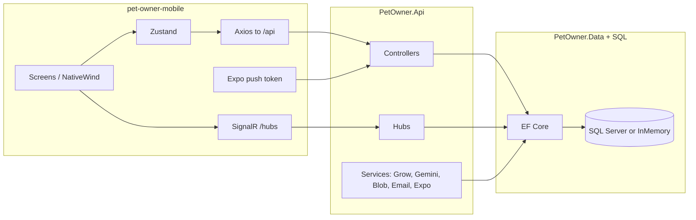

# PetOwner — AI & engineer handbook (API, mobile, database, business)

**Purpose:** Give another assistant (or human) enough context to write **precise prompts** and **safe code changes** for this monorepo. Focus is **`PetOwner.Api`**, **`PetOwner.Data`**, and **`src/pet-owner-mobile`**. A separate browser SPA exists in the repo; it is **out of scope** for this document.

**Repo root:** the folder containing `PetOwner.sln`. Paths below are **relative to the repo root** unless stated otherwise.

**As of:** April 2026 (align prompts and expectations with the current tree).

---

## 1. What this product is (business & users)

**PetOwner** is a **pet-care marketplace and community platform**. It connects **pet owners** with **service providers** (dog walking, sitting, boarding, training, drop-in visits, and related services). The platform is not only scheduling and payments: it also includes **pet health tooling**, **social/community** features, and **real-time messaging**.

### 1.1 Core user roles

- **Pet owner:** Registers, manages **pets** and health data, discovers providers on a **map**, creates **bookings** and pays (via **Grow / Meshulam** integration in Israel), writes **reviews**, uses **teletriage** (AI symptom triage), participates in **posts**, **groups**, **playdates / pals** (including live **beacons**), and chats with others.
- **Provider:** Applies through **onboarding**; after **admin approval**, appears in map search; sets **availability**, **service rates** and **packages**, toggles **available now**, manages **bookings** (confirm, complete, cancel with rules), sees **earnings/stats** and exports.
- **Admin:** User management, **provider moderation** (approve, suspend, ban), demo seeding, operational helpers (e.g. SOS cleanup), contact inquiries, booking oversight. UI entry on mobile is **role-gated** (`Role` claim includes `Admin`).

### 1.2 Business flows that matter for implementation

1. **Discovery → booking → payment**
   - Owner finds provider (`GET /api/map/pins` and related), opens profile, starts booking.
   - **Primary commerce path for mobile:** `Booking` entity + **`/api/bookings`** + **Grow** payment URL + **`POST /api/webhooks/grow`** to finalize payment and sync `PaymentStatus` / notifications / achievements.
   - A **legacy** parallel path uses **`ServiceRequest` + `Payment`** (Stripe-shaped field names on `Payment` in the model) and **`/api/requests`**. The API still exposes it; **mobile work in this repo centers on `Booking`**, not the legacy request flow.

2. **Trust & quality**
   - **Reviews** can attach to a completed **Booking** (verified) or, in some cases, **direct** review for business providers (`/api/reviews`).

3. **Pet health**
   - CRUD for pets; **vaccinations**, **weight logs**, **medical record vault** (blob-backed files), **activities**.
   - **Teletriage:** structured assessment via **Google Gemini**; session history per pet.
   - **Health passport share:** time-limited **token**; public read at **`/api/public/health-passport/{token}`** (no JWT).

4. **Community & growth**
   - Global **feed** (`Post`), **community groups** and **group posts** (likes, comments).
   - **Playdates:** preferences, **events** (RSVP, comments), **beacons** (ephemeral “I’m here with my pet” style discovery).
   - **Pals** discovery near user with preference filters.

5. **Engagement & ops**
   - In-app **notifications** + **Expo push**; **SignalR** for live notification delivery to the app.
   - **Chat:** REST for history + **SignalR** for live send/receive.
   - **Contact inquiries** to support; **achievements** unlocked on key events (e.g. successful payment).

### 1.3 Locale and market assumptions

- **Default language** in data model for users is often **`he-IL`**; the mobile app supports **Hebrew/English** and **RTL** (see mobile section).
- **Currency** defaults toward **`ILS`** in payment-related models; **Grow (Meshulam)** is the payment integration name used in code and config (`GrowSettings`).

---

## 2. Repository map (relevant parts only)

| Path | Role |
|------|------|
| `PetOwner.sln` | Solution: **PetOwner.Data**, **PetOwner.Api**, **PetOwner.Api.Tests**. |
| `src/PetOwner.Data/` | EF Core models, `ApplicationDbContext`, migrations, SQL Server + **NetTopologySuite** geography. |
| `src/PetOwner.Api/` | ASP.NET Core 8: REST controllers, DTOs, services, SignalR hubs, `Program.cs`, middleware. |
| `src/PetOwner.Api.Tests/` | API tests. |
| `src/pet-owner-mobile/` | **Expo ~54**, **React Native ~0.81**, **React 19** — **primary** end-user app. |

---

## 3. Database (`PetOwner.Data`)

### 3.1 Technology

- **.NET 8** class library, **EF Core 8**, **SQL Server** in non-development environments.
- **NetTopologySuite** for `geography` columns (e.g. `Location.GeoLocation`, `PlaydateEvent.GeoLocation`).
- **BCrypt** for password hashes (registration/login; admin seeding uses the same style).

### 3.2 Runtime behavior (critical for debugging)

- **Development:** in-memory database `PetOwnerDev` + **`EnsureCreated()`** — not SQL Server; **spatial and some behaviors differ** from production.
- **Production:** SQL Server with **`Migrate()`** on startup.
- **Connection string:** `ConnectionStrings:DefaultConnection` or environment **`DATABASE_URL`** (see `Program.cs`).

**Implication for prompts:** Any bug that only appears in prod/staging is often **geo** or **SQL-specific**; verify against SQL Server + migrations, not only in-memory.

### 3.3 Entity inventory (authoritative from `ApplicationDbContext`)

**Identity, provider, location**

- `User` — `Role` (e.g. `Admin`), `Email`, `Phone`, `GoogleId`, `AppleId`, `PreferredLanguage`, password reset fields, `IsActive`, etc.
- `ProviderProfile` — **1:1** with `User` (`UserId` PK), status (`ProviderStatus`: pending/approved/…), bio, address, `ServiceType`, ratings, `StripeConnectAccountId` (legacy name), **dog sizes** list serialized to column, view/search counters.
- `Location` — **1:1** with `User`; **`GeoPoint`** in DB as **geography**.
- `Service`, `ProviderService` (M:N), `ProviderServiceRate` (per `Service` enum with rate/unit), `ServicePackage` (packages linked to a rate), `AvailabilitySlot`, `FavoriteProvider`.

**Pets and health**

- `Pet` — owner FK, species, **lost** fields, `CommunityPostId` linkage possible, **tags** CSV, etc.
- `MedicalRecord`, `Vaccination`, `WeightLog` — with optional links between immunization/weight and medical records (unique optional FKs; delete behaviors carefully configured in fluent API).
- `TeletriageSession`, `Activity`.
- `PetHealthShare` — **token** + `ExpiresAt` for passport sharing.

**Commerce**

- `ServiceRequest` + `Payment` — **legacy** request/accept flow; `Payment` stores **`StripePaymentIntentId`** in DB (naming legacy) — tied 1:1 to `ServiceRequest`.
- `Booking` — **primary** mobile booking: `OwnerId`, `ProviderProfileId`, `Service` (`ServiceType`), time range, `BookingStatus`, **`PaymentStatus`**, `PaymentUrl`, `TransactionId` (Grow), optional **`CancelledByRole`**, `RespondedAt`, etc.
- `Review` — **one** review per `ServiceRequest` **or** per `Booking` (filtered unique indexes).

**Social and community**

- `Post`, `PostLike`, `PostComment`, `PostCommentLike` (threaded global feed).
- `CommunityGroup`, `GroupPost`, `GroupPostLike`, `GroupPostComment`.

**Messaging and notifications**

- `Conversation` (unique pair `User1Id`/`User2Id`), `Message`.
- `Notification` — in-app list + triggers for SignalR/push.
- `UserPushToken`, `UserNotificationPrefs` (per-category booleans, `PushEnabled` master).

**Playdates / pals**

- `PlaydatePrefs` (1:1 user; opt-in, distance, species/size prefs, `IncludeAsProvider`, activity timestamps),
- `PlaydateEvent` + `PlaydateRsvp` + `PlaydateEventComment`,
- `PlaydateBeacon` (ephemeral; lat/lng indexes + `ExpiresAt`).

**Other**

- `ContactInquiry`, `AchievementUnlocked` (idempotent per user + code).

### 3.4 Migrations

Located under `src/PetOwner.Data/Migrations/`. New schema changes: **add migration, update `ApplicationDbContext` configuration if needed, deploy** so production runs `Migrate()`.

---

## 4. Backend API (`PetOwner.Api`)

### 4.1 Stack and entry

- **ASP.NET Core 8**, JWT Bearer, **SignalR**, Swagger in Development.
- **Controllers** (24): `Auth`, `Map`, `Providers`, `Pets`, `MedicalRecords`, `Activities`, `HealthPassport`, `Teletriage`, `Requests`, `Bookings`, `Reviews`, `Posts`, `Community`, `Playdates`, `Pals`, `Chat`, `Notifications`, `Users`, `Favorites`, `Files`, `Support`, `Webhooks`, `Admin`, `Health`.

### 4.2 `Program.cs` — behaviors to remember

- **JWT:** `Jwt:Key` **required**; issuer/audience from config. **SignalR** accepts token via query string **`access_token`** on `/hubs/*` (see `OnMessageReceived`).
- **CORS:** Development allows any origin with credentials; **Production** requires **`Cors:AllowedOrigins`** or startup throws.
- **Rate limit:** policy **`AuthPolicy`** — 5 req/min per IP (used on e.g. register); extend for other routes if needed.
- **JSON:** enums as **strings** (`JsonStringEnumConverter`).
- **Hosted services:** `BookingExpirationService`, `VaccinationReminderService`.
- **Static files + `MapFallbackToFile("index.html")`:** the API process may host a SPA; **mobile does not depend on that** for API calls (uses `EXPO_PUBLIC_API_URL` / server root).

**Development seeding:** Admin users and optional **approved provider profiles** for seeded admins are applied so local testing of provider and admin flows works without full onboarding. Details are in `Program.cs` (do not duplicate secrets in docs).

### 4.3 Authentication summary

- Email/password, **Google** and **Apple** social login (`POST /api/auth/social-login` in `AuthController`).
- **`[Authorize]`** on most business endpoints; **`[Authorize(Roles = "Admin")]`** for admin.
- **Anonymous by design:** `GET /api/public/health-passport/{token}`, `POST /api/webhooks/grow` (validated by shared key/HMAC, not by JWT), `GET /api/health`.

### 4.4 SignalR

| Hub | URL | Main pattern |
|-----|-----|----------------|
| Notifications | `/hubs/notifications` | User joins group = **user id string**; server pushes events for that user. |
| Chat | `/hubs/chat` | e.g. `SendMessage` to recipient; persists `Message` + `Conversation`. |

Client must send JWT: **Authorization header** or **`?access_token=`** for hub URLs.

### 4.5 External services (server-side)

| System | Use |
|--------|-----|
| **Grow (Meshulam)** | Create payment / redirect for bookings; webhook updates state. |
| **Google Gemini** | Teletriage assessments. |
| **Azure Blob** | Images/documents; optional SAS. |
| **Expo Push** | HTTP to `https://exp.host` for device pushes. |
| **SMTP** | Email (password reset, etc.). |
| **Google/Apple** | ID token validation for social login. |

### 4.6 HTTP API catalog (base path `/api`)

Unless noted, routes are **`[Authorize]`**. Mobile axios uses **`{SERVER_ROOT}/api`** so client paths are **relative to `/api`**.

- **`GET /api/health`** — liveness.
- **`/api/auth`:** `register` (rate-limited), `login`, `social-login`, `forgot-password`, `reset-password`, `me`, `profile`, `me/phone`, etc.
- **`/api/map`:** `pins` (geo + filters; may update **search appearance** stats), `service-types`, **`/api/providers/{id}/profile`**, `users/{id}/mini-profile`, `providers/{id}/contact` (some actions live on `MapController` with route overrides — check source when wiring new clients).
- **`/api/providers`:** `apply`, `generate-bio`, `availability`, `me`, `me/schedule`, `upload-image`, `me/earnings` (+ `transactions`, `sparkline`), `me/stats`, `me/booking-stats` (+ export csv/xlsx), `me/stripe-connect` (legacy naming).
- **`/api/pets`:** full CRUD, `report-lost`, `mark-found`, `GET /lost`.
- **`/api/pets/{petId}/...` (MedicalRecordsController):** `medical-records`, `vaccinations`, `vaccine-status`, `weight-logs`, `weight-history`; plus **`GET /api/bookings/{bookingId}/medical-records`** where routed on the same controller.
- **`/api/pets/{petId}/activities`:** CRUD + `summary`.
- **Health passport:** `POST /api/pets/{petId}/health-passport/share` — `GET /api/public/health-passport/{token}` public.
- **`/api/teletriage`:** `assess`, `history/{petId}`, `/{id}`, `nearby-vets`.
- **`/api/requests`:** legacy service requests lifecycle.
- **`/api/bookings`:** create, get by id, `mine`, confirm, complete, cancel.
- **`/api/reviews`:** create (booking or `direct`), list by `provider/{id}`.
- **`/api/posts`:** feed, CRUD, likes, threaded comments, comment likes.
- **`/api/community`:** groups, group posts, likes, comments; admin subpaths for group CRUD.
- **`/api/playdates`:** events, RSVP, comments.
- **`/api/pals`:** `me/prefs`, `nearby`, `playdate-request`, beacons active/create/delete.
- **`/api/chat`:** conversations, messages, read receipts.
- **`/api/notifications`:** list, unread count, read, read-all, delete.
- **`/api/users`:** push token register/remove, `notification-prefs`, `me/stats` (+ exports).
- **`/api/favorites`:** list/toggle/check.
- **`/api/files`:** `upload/image`, `upload/document`, delete, SAS helpers.
- **`/api/support`:** `inquiries`.
- **`/api/webhooks/grow`:** payment callback.
- **`/api/admin`:** admin-only operations (see `AdminController` for full list).

**Always confirm** parameter names and exact subpaths in the controller if something fails — this handbook is a **map**, not a substitute for line-accurate OpenAPI in edge cases.

---

## 5. Mobile app (`src/pet-owner-mobile`)

### 5.1 Technology (exact enough for dependency questions)

- **Expo** ~54, **React Native** ~0.81, **React** 19, **TypeScript** ~5.9.
- **Styling:** **NativeWind** 4 + **Tailwind** 3 (`global.css`).
- **Navigation:** **React Navigation** 7 (bottom tabs + native stacks).
- **HTTP:** **Axios** (`src/api/client.ts`): default timeout **15s**; teletriage/uploads often **60s**.
- **Realtime:** `@microsoft/signalr` (notifications + chat).
- **Forms:** `react-hook-form` + `zod` 4.
- **State:** **Zustand** under `src/store/`.
- **Maps:** `react-native-maps`.
- **Push:** `expo-notifications` + `src/services/pushService.ts` posting to `/api/users/push-token`.
- **Auth storage:** `expo-secure-store` (native).
- **i18n:** `src/i18n` with RTL (`I18nManager`), Hebrew/English.
- **Tests:** Jest (`npm test`); E2E Playwright (`e2e/`, `npm run test:e2e`).

### 5.2 Server configuration

`src/config/server.ts`:

- **`EXPO_PUBLIC_API_URL`** — server root **without** trailing slash. If unset in dev, **warning** in console; fallback to a **documented** production host in source (use `.env` for real local/staging work).
- **`API_BASE_URL`** = `{SERVER_ROOT}/api`
- **`NOTIFICATIONS_HUB_URL`** = `{SERVER_ROOT}/hubs/notifications`
- **`CHAT_HUB_URL`** = `{SERVER_ROOT}/hubs/chat`

### 5.3 API client and types

- Central **`src/api/client.ts`**: request interceptor adds **`Authorization: Bearer`**, 401 with token triggers **logout** + localized session message.
- Grouped API helpers: `authApi`, `mapApi`, `petsApi`, `chatApi`, `providerApi`, `usersApi`, `triageApi`, `postsApi`, `communityApi`, `adminApi`, `supportApi`, `notificationsApi`, `filesApi`, `bookingsApi`, `medicalApi` (alias `petHealthApi`), `favoritesApi`, `palsApi`, `playdatesApi`, plus `reviewsApi`, `activitiesApi` modules.
- **`src/types/api.ts`** — large DTO mirror; must stay in sync with API/DTOs when contracts change.

### 5.4 Zustand stores (typical touch points)

- `authStore` — token, user id, role, **phone completion gate** after social login, `hydrate`, `logout`, language.
- `notificationStore`, `chatStore` — hub wiring + tab badges.
- `petsStore`, `bookingsStore`, `reviewsStore`, `favoritesStore`, `activitiesStore`, `providerDashboardStore`, `notificationPrefsStore`, `themeStore`, `myPetsUiStore`.

### 5.5 Navigation (conceptual)

`src/navigation/AppNavigator.tsx` — main tabs: **Explore**, **Community**, **My Pets**, **Messages** (if logged in), **Profile** or **Login**. **Gating:** `CompleteProfileScreen` when **`requiresPhone`** after social login. Tab bar can hide on deep screens; **SOS FAB** in tab wrapper. **Deep links** for notification taps: `navigationRef` + `notificationRouter.ts`.

### 5.6 Notable feature folders

- `src/features/provider-onboarding/` — multi-step provider apply.
- `src/components/global-modal/` — global modals and alert compatibility.
- `src/screens/*` — feature screens (explore, community, pets, profile, auth, etc.).
- `src/services/signalr.ts`, `pushService.ts`, `biometricService.ts`.
- `src/utils/HealthPassportPdf.ts`, `imagePicker.ts`, etc.

---

## 6. End-to-end mental model (API + mobile + DB)

**Booking + payment path:** mobile creates booking via **`bookingsApi`** → API persists **`Booking`**, may return **`PaymentUrl`** → user pays in **WebView** → Grow calls **`/api/webhooks/grow`** → `Booking` payment fields and notifications/achievements update.

---

## 7. How another assistant should write prompts (for this codebase)

Use these patterns so the coding agent (e.g. Cursor) gets **enough** but **not ambiguous** context.

### 7.1 Always specify scope

- **Which surface:** `PetOwner.Api` only, `PetOwner.Data` + migration, `pet-owner-mobile` only, or **full stack** (then say so explicitly).
- **Which feature:** e.g. “bookings cancel rules”, not “fix the app”.

### 7.2 For API changes, include

- **Route + verb** (or controller/method name), **auth** expectation, **request/response shape** (or “mirror existing DTO X”).
- **DB impact:** new column → migration; **breaking** DTO change → mention mobile `api.ts` + `client.ts`.

### 7.3 For mobile changes, include

- **Screen** or **store** name (file path if known), **happy path** vs **error/401**, and whether **SignalR** or **push** is involved.
- **Config:** if API URL matters, say “use `EXPO_PUBLIC_API_URL` for local API”.

### 7.4 For bugs, include

- **Environment:** Development in-memory vs **staging/prod SQL** (especially **geo**).
- **Repro steps** and **expected vs actual**.
- **Logs** or HTTP status (401 vs 400 vs 500).

### 7.5 Example prompt stubs (fill in details)

- *“Add `PATCH /api/…` for … Authorized users only. Update `PetOwner.Data` model … add migration. Mirror DTOs in `pet-owner-mobile/src/types/api.ts`, add `…Api` method in `client.ts`, and wire `…Store` + `…Screen`.”*
- *“Fix: SignalR chat reconnects but messages duplicate. Inspect `src/services/signalr.ts` and `ChatHub` — propose minimal fix without changing REST contract.”*
- *“Extend `Booking` with field …; update `BookingsController` and mobile `bookingsStore` + booking detail screen. Run migration; do not break existing bookings.”*

### 7.6 What to avoid in prompts (reduces wrong edits)

- Vague “improve performance” without area.
- Asking to refactor broadly “while you’re at it” (conflicts with project preference for **focused diffs**).
- Assuming **localhost** is the default API (mobile default may point to remote unless `.env` is set).

---

## 8. Configuration reference (names only; values in secrets)

- **DB:** `ConnectionStrings:DefaultConnection` or `DATABASE_URL`
- **JWT:** `Jwt:Key`, `Jwt:Issuer`, `Jwt:Audience`, `Jwt:ExpireMinutes`
- **CORS (prod):** `Cors:AllowedOrigins` (array of origins)
- **Grow:** `GrowSettings` / `Grow:…` in configuration + webhook secret for `/api/webhooks/grow`
- **Blob, Email, Gemini:** respective options sections
- **App base URL:** for absolute links (e.g. health passport) — `App:BaseUrl` (confirm in API options)
- **Mobile:** `EXPO_PUBLIC_API_URL` for Expo

---

## 9. When changing the system: canonical checklist

1. **Data:** Model + `ApplicationDbContext` fluent config if needed + **migration** (for SQL).
2. **API:** Controller + DTOs + any service.
3. **Contract mirror:** `src/types/api.ts` + `client.ts` (or feature API module).
4. **UI/state:** Zustand store + screen(s); SignalR or push if applicable.
5. **Tests:** API tests and/or Jest/Playwright as appropriate.

**Geo / SQL vs InMemory:** test critical paths with **SQL Server** when touching `MapService`, beacons, playdates, or anything using **`geography`**.

---

## 10. Quick glossary

- **Grow / Meshulam** — payment provider used for booking checkout in this project.
- **ServiceRequest** — legacy request flow; different from **Booking** (primary for mobile).
- **Teletriage** — AI-assisted symptom assessment (Gemini), not a substitute for a vet.
- **Health passport** — tokenized, **expiring** public snapshot of pet health data.
- **SignalR** — real-time; JWT via header or `access_token` query for hubs.
- **ProviderProfile.UserId** — same as the **user** id of the provider; many FKs use `ProviderProfileId`.

---

*This handbook is a condensed but dense orientation. For line-level API details, read the named controllers and `ApplicationDbContext`. For the mobile surface, `AppNavigator.tsx`, `api/client.ts`, and `types/api.ts` are the first places to open.*
