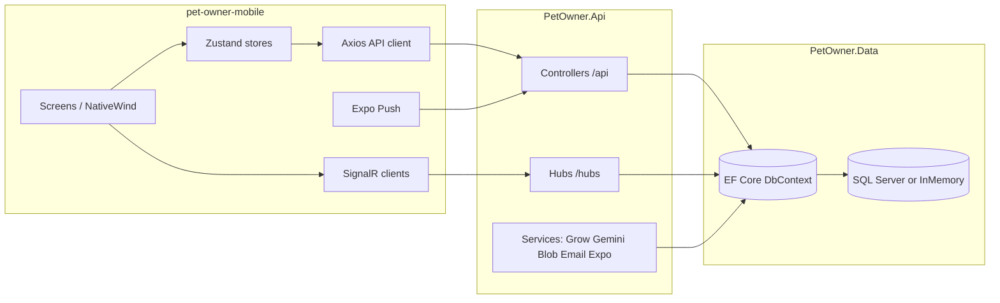

# PetOwner — Application Reference (for engineers and AI assistants)

This document describes the **PetOwner** monorepo: a pet-care marketplace and community platform with a **.NET 8** backend, **Entity Framework Core** data layer, **Expo / React Native** mobile client, and an older **Angular** web client. The sections below emphasize **`src/PetOwner.Api`** (HTTP API + real-time) and **`src/pet-owner-mobile`** (primary consumer app), while still situating the rest of the tree.

**Last oriented to repo layout as of April 2026.** Paths are relative to the repository root unless stated otherwise.

---

## 1. High-level product picture

PetOwner connects **pet owners** with **service providers** (walkers, sitters, boarding, training, etc.), layered with:

- **Discovery**: map pins, filters, public provider profiles, favorites, reviews.
- **Commerce**: **bookings** with payment flow integrated to **Grow (Meshulam)**; webhooks finalize payment state server-side.
- **Pet health**: pets CRUD, vaccinations, weight logs, medical record vault, **teletriage** (AI-assisted symptom assessment via **Google Gemini**), optional **health passport share links** (time-limited public token).
- **Community**: global social **posts** feed; **community groups** and group posts; **playdates / pals** (preferences, nearby users, live beacons, events, RSVPs, comments).
- **Messaging**: REST for history + **SignalR** hub for live chat.
- **Notifications**: in-app notification rows, **Expo push** delivery, **SignalR** notification hub for instant UI updates.
- **Provider lifecycle**: onboarding application, admin approval, availability slots, earnings/stats exports, trust metrics (ratings, view counts).
- **Admin**: user/role management, provider moderation, SOS cleanup, demo seeding, contact inquiries.

---

## 2. Repository layout (what lives where)

| Path | Role |
|------|------|
| `PetOwner.sln` | Visual Studio solution: **PetOwner.Data**, **PetOwner.Api**, **PetOwner.Api.Tests**. |
| `src/PetOwner.Data/` | EF Core models, `ApplicationDbContext`, SQL Server migrations, NetTopologySuite geography for user locations. |
| `src/PetOwner.Api/` | ASP.NET Core host: REST controllers, DTOs, services (payments, AI, blob, email, push), SignalR hubs, `Program.cs` pipeline. |
| `src/PetOwner.Api.Tests/` | xUnit (or similar) tests against the API layer. |
| `src/pet-owner-mobile/` | **Expo SDK ~54**, React Native **0.81**, React **19** — main mobile app (this doc’s “front end”). |
| `src/pet-owner-client/` | **Angular** SPA (legacy / parallel web UI); talks to the same API patterns as the mobile app in many areas. |
| `SmarterAspDeploy/` | Deployment-related artifacts (e.g. published API deps snapshot). |

Other markdown files may exist for audits or feature plans; this file is the **handoff-oriented** system overview.

---

## 3. Backend: `PetOwner.Data`

### 3.1 Technology

- **.NET 8** class library.
- **EF Core 8** with **SQL Server** provider + **NetTopologySuite** (`geography` for `Location.GeoLocation`).
- **BCrypt.Net-Next** for password hashes (used from `AuthController` and admin seeding).

### 3.2 `ApplicationDbContext`

Single DbContext exposes DbSets for all major aggregates, including:

**Identity & provider**

- `User`, `ProviderProfile` (1:1 with user; key is `UserId`), `Location`, `ProviderService`, `ProviderServiceRate`, `Service`, `AvailabilitySlot`, `FavoriteProvider`.

**Pets & health**

- `Pet`, `MedicalRecord`, `Vaccination`, `WeightLog`, `TeletriageSession`, `Activity`, `PetHealthShare` (tokenized health passport shares).

**Commerce (two parallel concepts)**

- **`ServiceRequest`** + **`Payment`** — older “request/quote/accept” style flow (still in DB and `RequestsController`; Angular client may lean on this more).
- **`Booking`** — newer first-class booking entity with `PaymentStatus`, Grow `PaymentUrl` / `TransactionId`, lifecycle endpoints under `/api/bookings`. **Mobile app uses bookings + Grow checkout.**

**Social & community**

- `Post`, `PostLike`, `PostComment`, `PostCommentLike` (threaded comments + comment likes).
- `CommunityGroup`, `GroupPost`, `GroupPostLike`, `GroupPostComment`.

**Messaging & notifications**

- `Conversation`, `Message`, `Notification`, `UserPushToken`, `UserNotificationPrefs`.

**Reviews**

- `Review` — can attach to **`ServiceRequest`** or **`Booking`** (unique filtered indexes per FK).

**Playdates**

- `PlaydatePrefs`, `PlaydateEvent`, `PlaydateRsvp`, `PlaydateEventComment`, `PlaydateBeacon`.

**Support & gamification**

- `ContactInquiry`, `AchievementUnlocked`.

### 3.3 Migrations

Under `src/PetOwner.Data/Migrations/`. Production applies migrations on startup (`Program.cs`); Development uses an **in-memory** database with `EnsureCreated()` (see below).

---

## 4. Backend: `PetOwner.Api`

### 4.1 Host & stack

- **ASP.NET Core 8** web project (`PetOwner.Api.csproj`).
- Key packages: **JWT Bearer** auth, **SignalR**, **Swashbuckle** (dev only), **Azure.Storage.Blobs**, **Google.Apis.Auth** (Google ID tokens), **ClosedXML** (Excel export), **SixLabors.ImageSharp**, **HttpClient**-based integrations.

### 4.2 `Program.cs` — critical behaviors

**Database**

- **Development**: `AddDbContext` → `UseInMemoryDatabase("PetOwnerDev")`, then `EnsureCreated()`.
- **Non-Development**: SQL Server + `UseNetTopologySuite()` + retry on failure; `Database.Migrate()` in Production.

**API surface**

- `MapControllers()` — all `[Route("api/...")]` controllers.
- `MapHub<NotificationHub>("/hubs/notifications")` and `MapHub<ChatHub>("/hubs/chat")`.
- Static files + `MapFallbackToFile("index.html")` — the API process can also **serve the Angular `index.html`** for SPA hosting in some deployments.

**Cross-cutting**

- `AddProblemDetails()` + `GlobalExceptionHandler`.
- **CORS**: Development allows any origin with credentials; Production requires configured `Cors:AllowedOrigins` array or startup throws.
- **JWT**: symmetric key from `Jwt:Key` (required); issuer/audience from config; **SignalR** reads JWT from query string `access_token` for `/hubs` paths.
- **Rate limiting**: named policy `"AuthPolicy"` — **5 requests / minute / IP** (used on auth register; extendable).
- **JSON**: enums serialized as strings (`JsonStringEnumConverter`).

**Dependency injection (representative)**

- `ITokenService`, Google/Apple token validators, `IMapService`, `IBlobService`, `IEmailService`, `IGeminiAiService`, `IGrowPaymentService`, `IExpoPushService`, `INotificationService`, `IAchievementService`, `DatabaseSeeder`.
- **Hosted services**: `BookingExpirationService`, `VaccinationReminderService`.

**Development-only seeding**

- After DB ensure/migrate, **admin users** are upserted from `AdminSeed:Users` or built-in defaults; BCrypt hashes refreshed; optional **approved provider profiles** for admins so provider APIs work without manual onboarding.

### 4.3 Authentication & authorization

- **Email/password**: register/login hash with BCrypt; JWT returned via `TokenService` with claims: `NameIdentifier` (user id GUID string), `Name`, `Email`, **`Role`**.
- **Social login**: `POST /api/auth/social-login` validates **Google** / **Apple** ID tokens, links or creates `User` rows (`GoogleId`, `AppleId` unique when present).
- **Password reset**: token + expiry columns on `User`; email via `IEmailService`.
- **Controllers**: most business routes use `[Authorize]`; **Admin** area uses `[Authorize(Roles = "Admin")]`.
- **Health passport public read**: `GET /api/public/health-passport/{token}` is **`[AllowAnonymous]`**.
- **Webhooks**: `POST /api/webhooks/grow` is **`[AllowAnonymous]`** but validated with shared **Grow webhook key**.

### 4.4 Real-time: SignalR

| Hub | Path | Grouping | Purpose |
|-----|------|----------|----------|
| `NotificationHub` | `/hubs/notifications` | Connection joins group named by **user id string** | Push server-initiated notification events to the correct user session(s). |
| `ChatHub` | `/hubs/chat` | `chat_{userId}` | `SendMessage(recipientId, content)` persists `Message`, updates `Conversation`, emits to recipient (and acknowledges sender). |

Both hubs use `[Authorize]`; clients should pass the JWT as **Bearer** header **or** `?access_token=` on the hub URL (server configures `OnMessageReceived` for `/hubs`).

### 4.5 External integrations (API project)

| Integration | Purpose |
|-------------|---------|
| **Grow (Meshulam)** | `IGrowPaymentService` creates payment process / redirect URL for **bookings**; `WebhooksController` confirms payment and updates `Booking` + notifications + achievements. |
| **Google Gemini** | `IGeminiAiService` powers **teletriage** assessments from structured + image payloads. |
| **Azure Blob Storage** | `IBlobService` stores uploaded images/documents; optional SAS URLs. |
| **Expo Push API** | `IExpoPushService` sends mobile push notifications via `https://exp.host` client. |
| **SMTP** | `SmtpEmailService` for transactional email (reset password, etc.). |
| **Google / Apple** | ID token validation for social login. |

### 4.6 Domain services of note

- **`MapService`**: geo query for provider pins; consumed by `MapController`.
- **`NotificationService`**: persists `Notification` rows, triggers SignalR and/or Expo push depending on prefs.
- **`AchievementService`**: unlocks achievements on key events (e.g. payment success).
- **`BookingExpirationService`**: time-based booking cleanup/state transitions (hosted).
- **`VaccinationReminderService`**: scheduled vaccination reminders (hosted).
- **`DatabaseSeeder`**: invoked from `AdminController` for demo content.

---

## 5. HTTP API catalog (`/api/...`)

Unless noted, assume **`[Authorize]`** on the controller. Base path is **`/api`** relative to the site origin (mobile uses `API_BASE_URL = {SERVER_ROOT}/api`).

### 5.1 `GET /api/health`

Liveness-style health check (`HealthController`).

### 5.2 Auth — `AuthController` → `/api/auth`

| Method | Path | Notes |
|--------|------|------|
| POST | `/register` | Rate-limited (`AuthPolicy`). |
| POST | `/login` | |
| POST | `/social-login` | Google / Apple. |
| POST | `/forgot-password` | |
| POST | `/reset-password` | |
| GET | `/me` | Current user profile snippet. |
| PUT | `/profile` | Update name/phone (returns refreshed auth token in app flows). |
| PUT | `/me/phone` | Phone update path used when social login still needs phone. |

### 5.3 Map & public provider surfaces — `MapController`

| Method | Path | Auth |
|--------|------|------|
| GET | `/api/map/pins` | Query filters: `requestedTime`, `serviceType`, `minRating`, `maxRate`, `radiusKm`, `latitude`, `longitude`, `searchTerm`, `providerType`. Increments **search appearance** stats for returned providers. |
| GET | `/api/map/service-types` | Ordered display names from `ServiceTypeCatalog`. |
| GET | `/api/providers/{providerId}/profile` | **Route override** `~/api/providers/...` on `MapController` — public approved provider card. |
| GET | `/api/users/{userId}/mini-profile` | Compact user info for UI. |
| GET | `/api/providers/{providerId}/contact` | Contact channel DTO for approved providers. |

### 5.4 Providers — `ProvidersController` → `/api/providers`

Provider self-service and stats (caller must be the provider user for `/me` routes).

| Method | Path | Summary |
|--------|------|---------|
| POST | `/apply` | Submit / update onboarding application. |
| POST | `/generate-bio` | AI-assisted bio text from notes. |
| PUT | `/availability` | Toggle “available now”. |
| PUT | `/me` | Update profile fields. |
| GET/POST | `/me/schedule` | List / create recurring availability slots. |
| PUT/DELETE | `/me/schedule/{id}` | Update / delete slot. |
| POST | `/upload-image` | Multipart profile image. |
| GET | `/me` | Full provider “me” payload for dashboard. |
| GET | `/me/earnings` (+ `/transactions`, `/sparkline`) | Earnings analytics. |
| GET | `/me/stripe-connect` | Stripe Connect reference (legacy naming may persist in DTOs). |
| GET | `/me/stats` | Provider stats. |
| GET | `/me/booking-stats` | Booking-based stats with `range` query. |
| GET | `/me/booking-stats/export.csv` / `export.xlsx` | Exports. |

### 5.5 Pets — `PetsController` → `/api/pets`

| Method | Path | Summary |
|--------|------|---------|
| GET | `/` | Current user’s pets. |
| POST | `/` | Create pet. |
| PUT | `/{id}` | Update. |
| DELETE | `/{id}` | Delete. |
| POST | `/{id}/report-lost` | Sets lost fields; may integrate with community/SOS flows. |
| POST | `/{id}/mark-found` | Clears lost state. |
| GET | `/lost` | Feed of lost pets (community discovery). |

### 5.6 Pet-scoped health & activities

**`MedicalRecordsController`** is routed as **`/api/pets/{petId}`** — all sub-routes require auth and pet ownership checks server-side.

| Area | Method | Path pattern |
|------|--------|----------------|
| Medical records | GET/POST | `/medical-records`, `/medical-records/{id}` |
| | PUT/DELETE | `/medical-records/{id}` |
| Vaccinations | GET/POST | `/vaccinations`, `/vaccinations/{id}` |
| | PUT/DELETE | `/vaccinations/{id}` |
| Vaccine derived status | GET | `/vaccine-status` |
| Weight | GET/POST | `/weight-logs`, `/weight-logs/{id}` |
| | PUT/DELETE | `/weight-logs/{id}` |
| Weight series | GET | `/weight-history` |
| Booking-scoped records | GET | `/api/bookings/{bookingId}/medical-records` | *(absolute route on controller)* |

**`ActivitiesController`** → `/api/pets/{petId}/activities`

- CRUD on activities; `GET .../summary` for aggregated stats.

### 5.7 Health passport (tokenized share)

Implemented in **`HealthPassportController`** with **explicit full routes** (no `[Route]` prefix on the controller class):

| Method | Path | Auth |
|--------|------|------|
| POST | `/api/pets/{petId}/health-passport/share` | Authorized owner; creates `PetHealthShare` token + URL. |
| GET | `/api/public/health-passport/{token}` | **Anonymous**; returns aggregated pet health snapshot while `ExpiresAt` valid. |

### 5.8 Teletriage — `TeletriageController` → `/api/teletriage`

| Method | Path | Summary |
|--------|------|---------|
| POST | `/assess` | Gemini-backed assessment from symptoms + optional image. |
| GET | `/history/{petId}` | Past sessions per pet. |
| GET | `/{id}` | Session detail. |
| GET | `/nearby-vets` | Proximity search result DTOs for emergency UI. |

### 5.9 Service requests (legacy flow) — `RequestsController` → `/api/requests`

| Method | Path | Summary |
|--------|------|---------|
| POST | `/` | Create request to provider. |
| GET | `/` | List requests for current user (owner/provider views merged in implementation). |
| PUT | `/{id}/accept`, `/{id}/reject`, `/{id}/complete`, `/{id}/cancel` | State transitions + side effects (notifications, etc.). |

*Mobile code in this repo centers on **bookings**; service requests remain part of the API for backward compatibility and the Angular client.*

### 5.10 Bookings — `BookingsController` → `/api/bookings`

| Method | Path | Summary |
|--------|------|---------|
| POST | `/` | Creates booking, may initiate Grow payment (returns DTO including payment URL as applicable). |
| GET | `/{id}` | Detail. |
| GET | `/mine` | Owner’s bookings. |
| PUT | `/{id}/confirm` | Provider confirms. |
| PUT | `/{id}/complete` | Completes job. |
| PUT | `/{id}/cancel` | Cancels with role-aware rules. |

### 5.11 Reviews — `ReviewsController` → `/api/reviews`

| Method | Path | Summary |
|--------|------|---------|
| POST | `/` | Review tied to completed **booking** (verified flow). |
| POST | `/direct` | Direct review for **business** providers without booking. |
| GET | `/provider/{providerId}` | List reviews for a provider. |

### 5.12 Social posts — `PostsController` → `/api/posts`

| Method | Path | Summary |
|--------|------|---------|
| GET | `/feed` | Paginated feed (`page`, `pageSize`, optional `category`). |
| POST | `/` | Create post. |
| DELETE | `/{id}` | |
| POST | `/{id}/like` | Toggle like + counts. |
| GET/POST | `/{postId}/comments` | List / add comments (threaded via parent id in DTOs). |
| PATCH/DELETE | `/comments/{commentId}` | Edit / delete comment. |
| POST | `/comments/{commentId}/like` | Comment likes. |

### 5.13 Community groups — `CommunityController` → `/api/community`

**Member**

- `GET /groups`, `GET /groups/{groupId}/posts`, `POST /groups/{groupId}/posts`
- `POST /posts/{postId}/like`
- `GET/POST /posts/{postId}/comments`

**Admin-only group CRUD**

- `GET/POST /admin/groups`, `GET/PUT/DELETE /admin/groups/{id}`

### 5.14 Playdates — `PlaydatesController` → `/api/playdates`

List/create events, RSVP, cancel, list/add/delete comments on events.

### 5.15 Pals (discovery + beacons) — `PalsController` → `/api/pals`

| Method | Path | Summary |
|--------|------|---------|
| GET/PUT | `/me/prefs` | Playdate pal preferences. |
| GET | `/nearby` | Geo / preference filtered pal discovery. |
| POST | `/{userId}/playdate-request` | Structured invitation/request. |
| POST | `/beacons` | Start live beacon. |
| GET | `/beacons/active` | Nearby active beacons. |
| DELETE | `/beacons/{id}` | End beacon. |

### 5.16 Chat (REST) — `ChatController` → `/api/chat`

| Method | Path | Summary |
|--------|------|---------|
| GET | `/conversations` | Inbox list with unread counts. |
| GET | `/{otherUserId}` | Paged messages. |
| POST | `/{otherUserId}/read` | Mark read. |

*Real-time message send/receive uses **`ChatHub`**.*

### 5.17 Notifications — `NotificationsController` → `/api/notifications`

| Method | Path | Summary |
|--------|------|---------|
| GET | `/` | Paginated notifications. |
| GET | `/unread-count` | |
| PUT | `/{id}/read` | |
| POST | `/read-all` | |
| DELETE | `/{id}` | |

### 5.18 Users — `UsersController` → `/api/users`

| Method | Path | Summary |
|--------|------|---------|
| POST | `/push-token` | Register Expo push token. |
| DELETE | `/push-token` | Remove token (body includes token). |
| GET/PUT | `/notification-prefs` | Per-category booleans. |
| GET | `/me/stats` | Owner stats with `range` query param. |
| GET | `/me/stats/export.csv` / `export.xlsx` | Owner booking stats export. |

### 5.19 Favorites — `FavoritesController` → `/api/favorites`

Toggle favorite, list favorites, list ids only, check single provider favorited.

### 5.20 Files — `FilesController` → `/api/files`

Multipart **`/upload/image`** and **`/upload/document`** with optional `folder` query; delete blob; SAS read helper.

### 5.21 Support — `SupportController` → `/api/support`

- `POST /inquiries` — authenticated user submits `ContactInquiry` for help center flows.

### 5.22 Webhooks — `WebhooksController` → `/api/webhooks`

- `POST /grow` — **anonymous** but HMAC/key validated; parses form or JSON; updates booking payment state from Grow fields (`cField1` carries `BookingId`).

### 5.23 Admin — `AdminController` → `/api/admin`

**Role `Admin` required.**

Representative capabilities:

- Dashboard stats, user list, role patch, active toggle.
- Bookings list, pending providers, approve provider.
- Provider moderation: suspend, ban, reactivate.
- Dev/demo: `seed-dummy-data`, `seed-bogus-pets`.
- Pets admin list/delete.
- Contact inquiries list + mark read.
- `clear-sos` operational helper.

---

## 6. Front end: `src/pet-owner-mobile`

### 6.1 Technology summary

| Layer | Choice |
|-------|--------|
| Runtime | **Expo** (~54), **React Native** 0.81, **React** 19 |
| Language | **TypeScript** 5.9 |
| Styling | **NativeWind** 4 + Tailwind 3 (`global.css`) |
| Navigation | **React Navigation** 7 — bottom tabs + nested native stacks |
| HTTP | **Axios** instance in `src/api/client.ts` |
| Real-time | **`@microsoft/signalr`** (`src/services/signalr.ts` and notification hub) |
| Forms / validation | **react-hook-form**, **zod**, `@hookform/resolvers` |
| State | **Zustand** stores under `src/store/` |
| Maps | **`react-native-maps`** (with `MapViewWrapper` / `.web` split where needed) |
| Push | **`expo-notifications`**, project `src/services/pushService.ts` |
| Auth storage | **`expo-secure-store`** (native) / `localStorage` (web) |
| i18n | Custom `src/i18n` with RTL support (`I18nManager`, Hebrew vs English) |

### 6.2 Configuration: API and hubs

`src/config/server.ts`:

- `EXPO_PUBLIC_API_URL` — optional; trims trailing slashes. If unset in dev, falls back to a **documented production** host (`https://petowner-production.up.railway.app`).
- **`API_BASE_URL`** = `{SERVER_ROOT_URL}/api`
- **`NOTIFICATIONS_HUB_URL`** = `{SERVER_ROOT_URL}/hubs/notifications`
- **`CHAT_HUB_URL`** = `{SERVER_ROOT_URL}/hubs/chat`

### 6.3 API client architecture

Primary file: **`src/api/client.ts`**

- Creates `axios` with `baseURL: API_BASE_URL`, JSON headers, **15s default timeout** (teletriage override **60s**; uploads **60s**).
- **Request interceptor**: attaches `Authorization: Bearer {token}` from `useAuthStore.getState()`.
- **Response interceptor**: on **401** with a bearer token present, calls **`logout()`** and shows localized session-expired alert; maps connectivity errors to friendly messages.

Exports grouped API objects (all relative to `/api` on the server, so client paths omit `/api` prefix):

- `authApi`, `mapApi`, `petsApi`, `chatApi`, `providerApi`, `usersApi`, `triageApi`, `postsApi`, `communityApi`, `adminApi`, `supportApi`, `notificationsApi`, `filesApi`, `bookingsApi`, `medicalApi` (alias `petHealthApi`), `favoritesApi`, `palsApi`, `playdatesApi`

Additional modules:

- **`src/api/reviewsApi.ts`** — `/reviews/...`
- **`src/api/activitiesApi.ts`** — `/pets/{petId}/activities/...`

Shared DTO TypeScript types live in **`src/types/api.ts`** (large central contract mirror).

### 6.4 State management (Zustand)

Under `src/store/`:

| Store | Responsibility |
|-------|------------------|
| `authStore` | JWT persistence, JWT decode for user id/name/email/**role**, `hydrate`, `logout`, `language`, phone completion gate, kicks off SignalR after login. |
| `notificationStore` | Unread counts, hub subscription, fetch list. |
| `chatStore` | Conversations, unread badge aggregation for tab bar. |
| `petsStore` | Pet list CRUD sync with backend. |
| `bookingsStore` | Owner booking flows. |
| `reviewsStore` | Provider reviews list + create review flows. |
| `favoritesStore` | Favorites list / toggle. |
| `activitiesStore` | Pet fitness-style activities. |
| `providerDashboardStore` | Provider-facing stats / dashboard data. |
| `notificationPrefsStore` | Push prefs mirror of `/users/notification-prefs`. |
| `themeStore` + `theme/ThemeContext` | Light/dark palette driving NavigationContainer theme. |
| `myPetsUiStore` | UI-only state for My Pets experience. |

### 6.5 Navigation map

File: **`src/navigation/AppNavigator.tsx`**

**Tabs**

1. **Explore** — stack: map / discover, provider profile, booking, reviews, payment WebView/checkout, chat room.
2. **Community** — stack: feed of groups, group detail, pal profile, playdate prefs, beacon detail, playdate event detail, create playdate.
3. **My Pets** — stack: pet dashboard, add pet, report lost, emergency vets, triage, activity log, nested provider/booking/reviews/payment flows reachable from pet context.
4. **Messages** (only when `isLoggedIn`) — inbox + chat room.
5. **Profile** (when logged in) or **Login** tab (guest) — profile home, provider edit/dashboard, **admin dashboard** (role-gated in UI), bookings, stats, notifications, settings subtree, provider onboarding, favorites, legal/help.

**Important gating**

- If `isLoggedIn && requiresPhone`, user is trapped in **`CompleteProfileScreen`** stack until phone captured (`social-login` incomplete profile path).

**Tab bar behavior**

- Floating pill tab bar styling; **hidden** on deep screens (see `HIDDEN_TAB_SCREENS` set).
- **Global SOS FAB** rendered inside custom tab bar wrapper (`TabBarWithSos`).

**Deep linking**

- `navigationRef` exported for `App.tsx` to route notification taps via `routeForNotification` (`src/services/notificationRouter.ts`).

### 6.6 Notable mobile features (by area)

- **Explore map**: `ExploreScreen`, `ExploreMapMarkers`, `mapCollision.ts`, diagnostics `exploreMapDiag.ts` — marker layout / collision avoidance for dense pins.
- **Booking + payment**: `BookingScreen`, `PaymentCheckoutScreen` — creates booking then typically opens Grow-hosted payment in **WebView**; server finalizes via webhook.
- **Provider onboarding**: `src/features/provider-onboarding/*` — multi-step wizard, zod schemas, availability review, image upload, packages step.
- **Teletriage**: `TriageScreen` + `triageApi.assess` with long timeout; `EmergencyVetsScreen` for map/list of vets.
- **Health passport**: `ShareHealthPassportModal`, `utils/HealthPassportPdf.ts`, `medicalApi.createShareLink` — share link returns URL under `/api/public/health-passport/...`.
- **Push notifications**: `pushService.ts` registers for Expo token, posts to `/users/push-token`, listens foreground/background taps; **master toggle** removes token from backend.
- **Biometrics**: `biometricService.ts` for optional local gate.
- **E2E**: Playwright config under `e2e/`; Jest unit tests under `src/__tests__/`.

### 6.7 Internationalization & RTL

- `src/i18n/index.ts` provides `translate` / hooks used across UI.
- **Hebrew** triggers RTL (`I18nManager.forceRTL`); production reload via `expo-updates` when direction flips.

---

## 7. Secondary web client: `src/pet-owner-client` (Angular)

- Angular workspace with feature modules for many of the same domains (bookings, pets, map, social, provider, admin, etc.).
- Uses environment files for API base URL; same JWT Bearer pattern.
- When hosted behind the API’s `MapFallbackToFile("index.html")`, relative `/api` calls hit the same origin.

*For AI-assisted work on “the app,” default to **`pet-owner-mobile`** unless the user explicitly references Angular files.*

---

## 8. Configuration cheat sheet (backend)

Typical `appsettings` / environment keys (names may vary slightly; infer from `Program.cs` and `IOptions<T>` registrations):

- **Database**: `ConnectionStrings:DefaultConnection` or **`DATABASE_URL`** env override.
- **JWT**: `Jwt:Key`, `Jwt:Issuer`, `Jwt:Audience`, `Jwt:ExpireMinutes`.
- **CORS (prod)**: `Cors:AllowedOrigins` string array.
- **Grow**: `GrowSettings` section (`Grow:...` keys) + webhook secret.
- **Blob**: `BlobStorageSettings` section.
- **Email**: `EmailSettings` section.
- **Gemini**: configured via `AddHttpClient<IGeminiAiService,...>` and related config section.
- **App base URL**: `App:BaseUrl` for absolute health passport share links.

---

## 9. How an AI assistant should extend this system

1. **API change** → Update controller + DTO + EF model/migration if needed → mirror types in **`pet-owner-mobile/src/types/api.ts`** → update **`client.ts`** (or feature `api/*.ts`) → update Zustand store + screen.
2. **Realtime change** → Update hub + **`signalr`** client handlers + any store that denormalizes counts.
3. **Payment/booking change** → Coordinate **`BookingsController`**, **`GrowPaymentService`**, **`WebhooksController`**, and mobile **`bookingsStore` / `PaymentCheckoutScreen`**.
4. **Geo search** → SQL Server + NetTopologySuite paths differ from InMemory; use `MapController` / `MapService` patterns for provider counters (`ExecuteUpdateAsync` vs dev loop).

---

## 10. Quick mental model

---

*End of reference document.*
