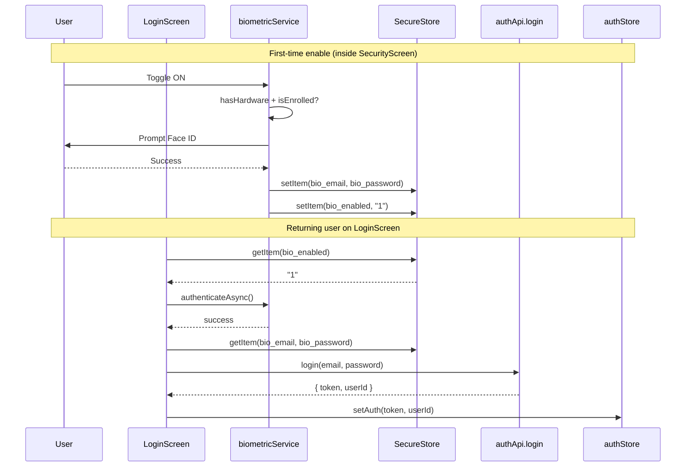

# Biometric Authentication Blueprint — `pet-owner-mobile`

> Status: Plan only. No `.tsx` files will be edited until this document is approved.

## 0. Goals & Decisions Snapshot

- **Feature**: Allow returning users to log in with Face ID / Touch ID / Android biometrics, bypassing manual email + password entry.
- **Toggle home**: Inside [src/screens/profile/SecurityScreen.tsx](src/pet-owner-mobile/src/screens/profile/SecurityScreen.tsx) (already linked from `AccountSettingsScreen` → "Login & Security"), as a new card next to **Change Password**.
- **Credential strategy**: Store the user's `email + password` encrypted in `expo-secure-store` (gated by device biometrics), then silently call the existing `authApi.login` after a successful biometric prompt. This is the only viable approach today because the backend in [src/pet-owner-mobile/src/api/client.ts](src/pet-owner-mobile/src/api/client.ts) does **not** expose a `/auth/refresh` endpoint, and the persisted JWT eventually expires (see `isTokenExpired` in [authStore.ts](src/pet-owner-mobile/src/store/authStore.ts)).
- **Web behavior**: No-op. The biometric module is native-only; the existing `Platform.OS === "web"` branches in `authStore.ts` will continue to use `localStorage` and the toggle UI will be hidden on web.

### High-level flow



---

## 1. Dependencies & App Config

### 1.1 New npm packages

Add to [src/pet-owner-mobile/package.json](src/pet-owner-mobile/package.json) via `npx expo install` so versions match Expo SDK 54:

- `expo-local-authentication` — biometric prompt (Face ID / Touch ID / Fingerprint).
- `expo-secure-store` — **already installed** (`~15.0.8`), reuse it.

No other libs needed (`SafeAreaView`, `Switch`, `Ionicons`, `Alert` are already used in the codebase).

### 1.2 `app.json` changes

Edit [src/pet-owner-mobile/app.json](src/pet-owner-mobile/app.json):

1. Add the iOS usage description so the OS-level Face ID prompt does not crash on iOS 14+:

```json
"ios": {
  "supportsTablet": true,
  "infoPlist": {
    "NSFaceIDUsageDescription": "Allow PetOwner to use Face ID for fast and secure sign-in."
  }
}
```

2. Register the plugin (it sets `USE_BIOMETRIC` permission on Android automatically):

```json
"plugins": [
  "expo-secure-store",
  "@react-native-community/datetimepicker",
  "expo-font",
  [
    "expo-local-authentication",
    {
      "faceIDPermission": "Allow PetOwner to use Face ID for fast and secure sign-in."
    }
  ]
]
```

3. Because Expo SDK 54 supports a single string for `NSFaceIDUsageDescription`, both forms above are kept in sync. Do **not** remove the i18n-localized variant later without updating `app.json`.

### 1.3 Localization

Add new keys to both locales in [src/pet-owner-mobile/src/i18n/index.ts](src/pet-owner-mobile/src/i18n/index.ts) (and the JSON in [src/pet-owner-client/src/assets/i18n/he.json](src/pet-owner-client/src/assets/i18n/he.json) only if shared — note that file belongs to the Angular client, not the mobile app, and is NOT used by `pet-owner-mobile`):

- `biometricLogin`, `biometricLoginDesc`
- `biometricEnableTitle`, `biometricEnablePrompt`
- `biometricLoginButton` ("Sign in with Face ID")
- `biometricUnavailable`, `biometricNotEnrolled`
- `biometricFailed`, `biometricFailedFallback`

---

## 2. State & Secure Storage Strategy

### 2.1 Storage keys (all in `expo-secure-store`)

| Key                   | Purpose                                      | Written by              | Cleared by                  |
| --------------------- | -------------------------------------------- | ----------------------- | --------------------------- |
| `auth_token`          | JWT (already exists)                         | `authStore.setAuth`     | `authStore.logout`          |
| `user_id`             | User id (already exists)                     | `authStore.setAuth`     | `authStore.logout`          |
| `bio_enabled`         | `"1"` when user opted in                     | `biometricService.enable` | `biometricService.disable`, `logout` |
| `bio_email`           | User's email (encrypted)                     | `biometricService.enable` | same as above               |
| `bio_password`        | User's password (encrypted)                  | `biometricService.enable` | same as above               |

`expo-secure-store` uses iOS Keychain (with `kSecAttrAccessibleWhenUnlockedThisDeviceOnly`) and Android Keystore. We will pass `requireAuthentication: true` and `keychainAccessible: SecureStore.WHEN_UNLOCKED_THIS_DEVICE_ONLY` when writing `bio_email` / `bio_password` so the OS gates them behind device unlock.

### 2.2 New module — `src/services/biometricService.ts` (pure TS, not `.tsx`)

Single source of truth for everything biometric. Exposed surface:

```ts
// Capability
isSupported(): Promise<boolean>;          // hardware + enrollment check
getSupportedTypeLabel(): Promise<"faceId" | "fingerprint" | "iris" | "generic">;

// State
isEnabled(): Promise<boolean>;            // reads bio_enabled

// Lifecycle
enable(email: string, password: string): Promise<void>;  // prompts biometric, writes 3 keys
disable(): Promise<void>;                                // wipes 3 keys

// Login flow
authenticateAndGetCredentials(): Promise<{email: string; password: string} | null>;
```

Internally `enable` and `authenticateAndGetCredentials` both call `LocalAuthentication.authenticateAsync({ promptMessage, cancelLabel, fallbackLabel, disableDeviceFallback: false })`.

### 2.3 `authStore` integration

Two minimal additions to [src/pet-owner-mobile/src/store/authStore.ts](src/pet-owner-mobile/src/store/authStore.ts):

1. In `logout()`, also call `biometricService.disable()` so a logout clears stored credentials. Rationale: explicit logout is a security signal that the device may be handed over.
2. Expose nothing else — biometric state lives in the service, not the store, to keep `authStore` lean. The Login screen and Security screen can read `biometricService.isEnabled()` directly.

**Why not store the JWT and "unlock" it?** The persisted JWT already exists (`auth_token`) but has a finite TTL (`isTokenExpired`). After expiry the user would be forced back to the password screen, defeating the feature. Storing the credentials and re-issuing a fresh token via the existing `/auth/login` endpoint avoids a backend change while still gating credential access behind biometrics + device passcode.

---

## 3. Settings Integration — The Toggle

### 3.1 Placement

Inside [src/pet-owner-mobile/src/screens/profile/SecurityScreen.tsx](src/pet-owner-mobile/src/screens/profile/SecurityScreen.tsx), add a new card **above** the "Change Password" card. Use the same card chrome (`borderRadius: 16`, `shadow*`) for visual consistency. The row contains:

- Leading icon: `Ionicons` `finger-print` (or `scan-circle-outline` if the supported type is Face ID).
- Title: `t("biometricLogin")`.
- Subtitle: `t("biometricLoginDesc")` ("Sign in with Face ID instead of typing your password").
- Trailing: native `Switch` bound to local state, hidden entirely if `biometricService.isSupported()` returns `false` or on web.

### 3.2 UX flow

#### Turning ON

1. User taps the switch.
2. We need their current password (we never stored it) → present an `Alert.prompt` (iOS) or a small custom `Modal` (Android, since `Alert.prompt` is iOS-only) asking for the password.
3. Re-verify by calling `authApi.login({ email: user.email, password })` — this both validates the credentials and avoids storing wrong passwords. On 401, show error and abort.
4. Call `biometricService.enable(email, password)`, which itself triggers a biometric prompt to confirm the user is the device owner.
5. On success, flip the switch and persist; on cancel/failure, leave switch off.

Edge: if `isSupported()` returns false at this point (race), show `t("biometricUnavailable")` and disable the switch.

#### Turning OFF

1. User taps the switch.
2. Confirm with a non-destructive `Alert` ("Disable biometric sign-in?").
3. Call `biometricService.disable()` (no biometric prompt needed for disable — disabling a security feature must not require it, otherwise a locked-out user can't recover).
4. Flip the switch.

### 3.3 Implicit cleanup

If the user changes their password via [ChangePasswordScreen.tsx](src/pet-owner-mobile/src/screens/profile/ChangePasswordScreen.tsx), the stored `bio_password` becomes stale. After a successful change, call `biometricService.disable()` and toast "Biometric sign-in was disabled — re-enable it in Security." This avoids silent failures on the next biometric login. (This is a small follow-up edit to the change-password handler.)

---

## 4. Login Screen Integration

Edit [src/pet-owner-mobile/src/screens/auth/LoginScreen.tsx](src/pet-owner-mobile/src/screens/auth/LoginScreen.tsx). Two cooperating changes:

### 4.1 "Sign in with Face ID" button

Below the existing **Sign-In Button** (line 248-261) and above the social divider, render a secondary button **only when** `biometricService.isEnabled()` resolves true and `isSupported()` is true. Use a chip-style button with the appropriate biometric icon.

### 4.2 Auto-prompt on mount — UX choice

Recommended: **soft auto-prompt once per LoginForm mount** (not on every focus), governed by a `useEffect` that:

1. Awaits `biometricService.isEnabled()` and `isSupported()`.
2. If both true and we have not auto-prompted in this mount, call `runBiometricLogin()`.

Why "once per mount, not on focus": the `LoginScreen` is also rendered after explicit logout (`isLoggedIn` early-return at line 31-59 actually shows the logged-in placeholder, so the form only mounts when truly logged out). Auto-prompting once avoids the annoying re-prompt loop if the user cancels.

Provide an opt-out: a tiny `t("loginWithPassword")` link directly under the button to dismiss the auto-prompt expectation and focus the email field.

### 4.3 `runBiometricLogin` helper (inside LoginForm)

```text
1. setBioLoading(true)
2. const creds = await biometricService.authenticateAndGetCredentials()
3. if (!creds) { setBioLoading(false); return; }     // user cancelled
4. try {
     const data = await authApi.login(creds);
     await setAuth(data.token, data.userId);
     navigation.navigate("Explore");
   } catch (err) {
     // Stale password (likely changed elsewhere) → disable + tell the user.
     if (err.response?.status === 401) {
       await biometricService.disable();
       Alert.alert(t("errorTitle"), t("biometricFailedFallback"));
     } else {
       Alert.alert(t("errorTitle"), t("loginError"));
     }
   } finally { setBioLoading(false); }
```

### 4.4 Edge cases checklist

- **Hardware missing / not enrolled** → button hidden, no auto-prompt. Fallback is the regular form.
- **User cancels Face ID** → silently return to form (no error toast).
- **Too many failed attempts (system lockout)** → `LocalAuthentication.AuthenticationType` returns an error; show `t("biometricFailed")` once and let user use the password.
- **Stored password no longer valid (server returns 401)** → wipe credentials, alert, focus email field.
- **Network failure on `authApi.login`** → keep `bio_enabled` true (the password may still be valid), show generic network error, allow retry.
- **App restart with expired JWT** but `bio_enabled=true` → existing `hydrate()` clears the expired token; `LoginForm` mounts; auto-prompt fires; user gets in seamlessly. This is the headline win of this approach.
- **Logout** → `authStore.logout` will call `biometricService.disable()` per §2.3. Re-enable from Security after the next manual login.

---

## 5. Step-by-Step Execution Strategy

Three small phases, each independently shippable and reviewable.

### Phase A — Config & Service (foundation, no UI)

Files: `app.json`, `package.json`, new `src/services/biometricService.ts`, `src/i18n/index.ts`, `src/store/authStore.ts` (one-line addition in `logout`).

1. `npx expo install expo-local-authentication`.
2. Patch `app.json` per §1.2 (Face ID string + plugin).
3. Add `biometricService.ts` with the API in §2.2. Cover `Platform.OS === "web"` by returning `false` from `isSupported`/`isEnabled` and no-op'ing the rest.
4. Add new i18n keys (he + en) per §1.3.
5. Wire `biometricService.disable()` into `authStore.logout`.
6. Smoke test on iOS simulator (Hardware → Face ID → Enrolled) and an Android emulator with fingerprint enrolled. No UI yet — exercise via a temporary debug button or a one-off REPL-style test.

Exit criteria: from the dev console you can `enable("a@b.com", "pw") → authenticateAndGetCredentials() → { email, password }`.

### Phase B — Settings Toggle

Files: `src/screens/profile/SecurityScreen.tsx`, optionally `src/screens/profile/ChangePasswordScreen.tsx` for the cleanup hook.

1. Add the new card with `Switch`, hidden when `!isSupported || Platform.OS === "web"`.
2. Implement the ON flow (password prompt → re-verify via `authApi.login` → `biometricService.enable`).
3. Implement the OFF flow (`biometricService.disable`).
4. Add the post-change-password cleanup (§3.3) — small, low-risk.

Exit criteria: toggle round-trips correctly across app restarts; switch reflects real `bio_enabled` state on mount; toggling off then on works without restart.

### Phase C — Login Flow

Files: `src/screens/auth/LoginScreen.tsx`.

1. Add `biometricService.isEnabled()` + `isSupported()` mount check.
2. Render the "Sign in with Face ID" button conditionally.
3. Implement `runBiometricLogin` per §4.3 and wire it to both auto-prompt and the button.
4. Add the small "Use password instead" link.
5. Verify all edge cases in §4.4 manually on device (real Face ID hardware preferred; simulators are unreliable for cancel flows).

Exit criteria: enable in Security → background app → kill it → reopen → biometric prompt → land on Explore without typing anything.

### Rollout & Risk

- **Risk**: storing a plaintext password in SecureStore is acceptable here because `expo-secure-store` is hardware-backed (Keychain / Keystore) and we additionally gate access behind a biometric prompt at read time. This matches the threat model of apps like banking/2FA managers that take the same route when no refresh-token API exists.
- **Future hardening (out of scope)**: add `/auth/refresh` to `PetOwner.Api`, switch to storing only a refresh token, and remove `bio_password`. The `biometricService` API is intentionally narrow so this swap is a one-file change later.
- No backend changes required for this feature.
- No data migration required — first-run users simply see the toggle off.
