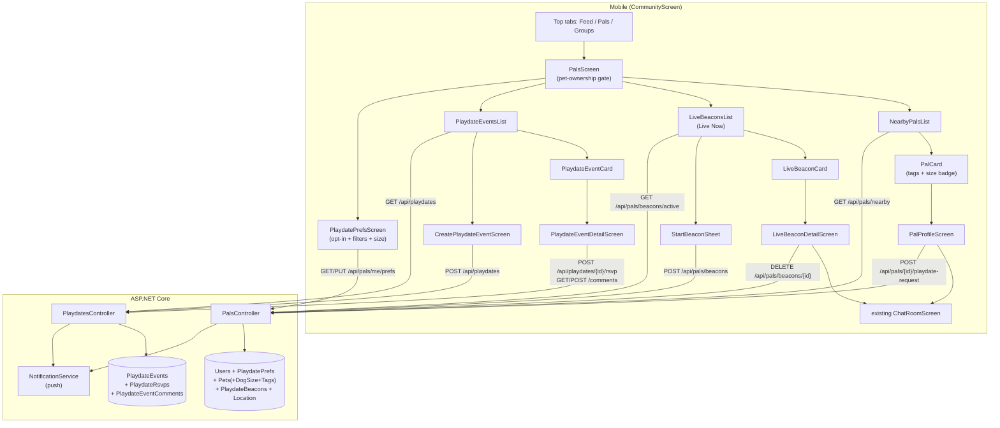
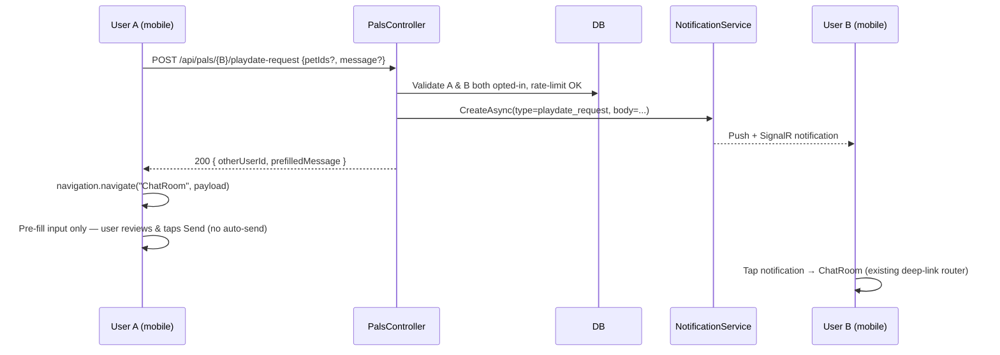

# Playdate Pals — Nearby Pet Owners + Playdate Events

> Status: Plan only. No `.ts/.tsx/.cs` files will be edited until this document is approved.

This plan introduces a **brand-new top-level section under Community** that lets pet owners discover nearby owners and organize playdates. It is intentionally a **separate doc from** [`COMMUNITY_POSTS_UPGRADE_PLAN.md`](src/pet-owner-mobile/COMMUNITY_POSTS_UPGRADE_PLAN.md) so the two efforts can ship and review independently.

---

## 0. Goals & Decisions Snapshot

- **Concept**: a third top-level tab in [`CommunityScreen.tsx`](src/pet-owner-mobile/src/screens/community/CommunityScreen.tsx) called **"Pals"** (he-IL: "פאלים"), sitting between "Feed" and "Groups". Inside it, a segmented control switches between **three** sub-experiences:
  1. **Nearby Pals** — opt-in browse of nearby pet owners with a one-tap "Send playdate request" CTA that opens the existing 1:1 chat with a pre-filled message.
  2. **Live Now (Beacons)** — real-time spontaneous "I'm at the dog park right now for the next hour" check-ins. Time-limited live status broadcast to nearby opted-in users with push, designed to drive immediate, FOMO-style discovery.
  3. **Playdate Events** — anyone can create a scheduled meetup at a park (place, time window, allowed species, max pets); nearby opted-in users see it, RSVP, and chat in a thread per event.
- **Why all three**: passive browsing (Nearby Pals) is low-commitment but lacks intent; scheduled events drive real outcomes but need lead time; live beacons fill the in-between "I'm here right now, who else wants to come?" niche that's the actual common case at urban dog parks. They share ~90% of the geo plumbing so the marginal cost of all three is small.
- **Hard product rules** (decided, not open questions):
  - **Pet ownership is required.** A user MUST have at least one pet on their profile to access the Pals tab, view nearby pals, create/RSVP a beacon or event, or send a playdate request. Without a pet there is no playdate, and gating it prevents people-hunting / creepy behavior. The tab itself stays visible but renders a "Add a pet to use Pals" gate screen with a CTA to `AddPetScreen`.
  - **Dog size filter is v1, not v1.5.** Mismatched sizes are a real-world safety risk (a 3 kg toy poodle should never be funneled into a playdate suggestion with a 50 kg Rottweiler). `Pet` gains a `DogSize?` field as part of this feature's migration, the field is mandatory at pet-create time when species is `DOG`, and the nearby/beacon/event filters all enforce it.
  - **First chat message is pre-filled, never auto-sent.** The user always reviews and taps Send themselves. No silent outbound messages.
  - **On-duty service providers are excluded from Nearby Pals** unless they have explicitly opted in *with their own personal pet* via `PlaydatePrefs`. The mere presence of a `ProviderProfile` is not enough — being a dog walker with 6 client dogs ≠ being available for personal social playdates.
- **Privacy first**: opt-in default OFF. Exact lat/lng are **never** returned to other users — only `distanceKm` rounded to 0.5 km, plus `City`. Event and beacon coordinates are public (since they're meetups).
- **Reuse, don't rebuild**:
  - 1:1 chat already exists (`chatApi`, `ChatRoomScreen`); a "playdate request" is just `navigation.navigate("ChatRoom", { otherUserId, prefilledMessage })` — no new conversation infrastructure.
  - Geo filtering follows the lat/lng-bounding-box pattern already in [`PostsController.GetFeed`](src/PetOwner.Api/Controllers/PostsController.cs) (lines 36-44) but upgraded to NetTopologySuite distance, since `User.Location.GeoLocation` is already a `Point`.
  - Place picking reuses [`AddressMapModal`](src/pet-owner-mobile/src/features/provider-onboarding/AddressMapModal.tsx).
  - Push notifications go through the existing `NotificationService.CreateAsync` pipeline described in [`PUSH_NOTIFICATIONS_PLAN.md`](src/pet-owner-mobile/PUSH_NOTIFICATIONS_PLAN.md).
  - Existing `DogSize` enum (`SMALL/MEDIUM/LARGE/GIANT`) from [`src/PetOwner.Data/Models/DogSize.cs`](src/PetOwner.Data/Models/DogSize.cs) — already used by `ProviderProfile` capacity — gets reused on `Pet` so dashboards stay consistent.
- **Web is a no-op**: this is a location-first feature; on web we render the Pals tab as a friendly "Open the mobile app to find nearby pals" placeholder. All `expo-location` calls are guarded by `Platform.OS !== "web"`.

### High-level architecture



### Lifecycle of a playdate request



### Lifecycle of a Live Beacon

```mermaid
sequenceDiagram
    participant H as Host (mobile)
    participant API as PalsController
    participant DB as DB
    participant N as NotificationService
    participant Near as Nearby opted-in users

    H->>H: Tap "I'm here now" → StartBeaconSheet
    H->>API: POST /api/pals/beacons {placeName, lat, lng, durationMin, petIds}
    API->>DB: Validate H opted-in, has pet, no other active beacon
    API->>DB: INSERT PlaydateBeacon (ExpiresAt = now + durationMin)
    API->>N: Fan-out push to up to 50 nearest opted-in users\n("Rex & Jonathan are at Hayarkon Park now")
    N-->>Near: Push (gated by community pref)
    Near->>API: GET /api/pals/beacons/active
    API-->>Near: List of currently-live beacons (ExpiresAt > now)
    Near->>H: Tap beacon → BeaconDetail → "Say hi" → ChatRoom (pre-filled)
    Note over API,DB: Background: beacons auto-expire by ExpiresAt timestamp;\nGET filters them out. No deletion required.
```

---

## 1. Data Model

All new entities land in `src/PetOwner.Data/Models/` and are wired up in [`ApplicationDbContext.cs`](src/PetOwner.Data/ApplicationDbContext.cs). Single migration: `AddPlaydateFeature`.

### 1.1 `PlaydatePrefs` (one-to-one with `User`)

```csharp
namespace PetOwner.Data.Models;

public class PlaydatePrefs
{
    public Guid UserId { get; set; }              // PK + FK to User
    public bool OptedIn { get; set; }              // default false
    public int MaxDistanceKm { get; set; } = 5;    // 1..50, default 5
    public string? Bio { get; set; }               // optional one-liner, max 280 chars
    public string PreferredSpeciesCsv { get; set; } = ""; // "dog,cat" — empty = all
    public string PreferredDogSizesCsv { get; set; } = ""; // uses existing DogSize enum names
    public bool IncludeAsProvider { get; set; }    // default false — see §6
    public DateTime LastActiveAt { get; set; }    // bumped on every Pals API call
    public DateTime CreatedAt { get; set; }
    public DateTime UpdatedAt { get; set; }

    public User User { get; set; } = null!;
}
```

`IncludeAsProvider` is the explicit-opt-in flag described in the Goals snapshot: only when this is `true` AND the user has at least one personal `Pet` will the user surface in `Nearby Pals` results even though they also have a `ProviderProfile`. The flag is irrelevant for non-providers (the server simply ignores it).

`User.cs` gains:

```csharp
public PlaydatePrefs? PlaydatePrefs { get; set; }
```

`ApplicationDbContext`:

- `public DbSet<PlaydatePrefs> PlaydatePrefs => Set<PlaydatePrefs>();`
- Configure `HasKey(p => p.UserId)` and `HasOne(p => p.User).WithOne(u => u.PlaydatePrefs).OnDelete(DeleteBehavior.Cascade)`.
- Index on `(OptedIn, LastActiveAt)` so the nearby query can narrow before the geo filter.

### 1.2 `PlaydateEvent`

```csharp
public class PlaydateEvent
{
    public Guid Id { get; set; }
    public Guid HostUserId { get; set; }
    public string Title { get; set; } = null!;        // max 120
    public string? Description { get; set; }           // max 1000
    public string LocationName { get; set; } = null!;  // e.g. "Park Hayarkon — south gate"
    public double Latitude { get; set; }
    public double Longitude { get; set; }
    public string? City { get; set; }
    public DateTime ScheduledFor { get; set; }         // UTC start
    public DateTime? EndsAt { get; set; }              // optional UTC end
    public string AllowedSpeciesCsv { get; set; } = "dog"; // CSV of PetSpecies enum names
    public int? MaxPets { get; set; }                  // null = unlimited
    public DateTime CreatedAt { get; set; }
    public DateTime? CancelledAt { get; set; }
    public string? CancellationReason { get; set; }

    public User Host { get; set; } = null!;
    public ICollection<PlaydateRsvp> Rsvps { get; set; } = new List<PlaydateRsvp>();
    public ICollection<PlaydateEventComment> Comments { get; set; } = new List<PlaydateEventComment>();
}
```

Indexes: `(ScheduledFor, CancelledAt)`, `(Latitude, Longitude)`. Use NetTopologySuite computed column `GeoLocation` if we want true KNN later, but a bounding-box prefilter + Haversine is plenty for v1.

### 1.3 `PlaydateRsvp`

```csharp
public enum RsvpStatus { Going = 1, Maybe = 2, NotGoing = 3 }

public class PlaydateRsvp
{
    public Guid EventId { get; set; }                 // composite PK with UserId
    public Guid UserId { get; set; }
    public Guid? PetId { get; set; }                  // optional — which pet they're bringing
    public RsvpStatus Status { get; set; }
    public DateTime CreatedAt { get; set; }
    public DateTime UpdatedAt { get; set; }

    public PlaydateEvent Event { get; set; } = null!;
    public User User { get; set; } = null!;
    public Pet? Pet { get; set; }
}
```

Composite PK `{ EventId, UserId }`. `OnDelete` cascade from event; `OnDelete` restrict on `User` and `Pet` (preserve event history).

### 1.4 `PlaydateEventComment` (event chat thread)

Mirrors [`PostComment`](src/PetOwner.Data/Models/Post.cs) without replies/likes (kept minimal in v1):

```csharp
public class PlaydateEventComment
{
    public Guid Id { get; set; }
    public Guid EventId { get; set; }
    public Guid UserId { get; set; }
    public string Content { get; set; } = null!;
    public DateTime CreatedAt { get; set; }

    public PlaydateEvent Event { get; set; } = null!;
    public User User { get; set; } = null!;
}
```

### 1.5 `PlaydateBeacon` (Live "I'm here now" check-in)

A beacon is a short-lived, geo-anchored "Live Now" status. It is **not** a scheduled event — there is no RSVP, no comments, and no editing. It expires automatically.

```csharp
public class PlaydateBeacon
{
    public Guid Id { get; set; }
    public Guid UserId { get; set; }
    public string PlaceName { get; set; } = null!;     // e.g. "Park Hayarkon — south gate", max 120
    public double Latitude { get; set; }
    public double Longitude { get; set; }
    public string? City { get; set; }
    public DateTime CreatedAt { get; set; }
    public DateTime ExpiresAt { get; set; }            // CreatedAt + duration; max 3h
    public DateTime? EndedAt { get; set; }             // user-cancelled early; otherwise null
    public string PetIdsCsv { get; set; } = "";        // CSV of Guids — which of the host's pets are present
    public string Species { get; set; } = "DOG";       // primary species, used for filtering

    public User User { get; set; } = null!;
}
```

Constraints / behaviors:

- Duration choices: **30 min / 1 h / 2 h / 3 h** (UI-enforced). Server clamps `ExpiresAt - CreatedAt` to `[15, 180]` minutes.
- A user may have **at most one active beacon** at a time. Starting a new one ends the previous (`EndedAt = UtcNow`).
- "Active" = `EndedAt IS NULL AND ExpiresAt > UtcNow`. No background job required — filtering happens on read.
- Indexes: `(UserId, ExpiresAt)`, `(ExpiresAt)`, `(Latitude, Longitude)`.
- `OnDelete(DeleteBehavior.Cascade)` from `User`.

### 1.6 `Pet` model extensions

To unblock the **mandatory** dog-size filter and the visual characteristic tags described in §0, the `Pet` entity gains three new fields. These live alongside the existing pet attributes and are exposed in `AddPetScreen` / `EditPetScreen` (mobile) so users can fill them once and have them flow through every Pals surface.

```csharp
public class Pet
{
    // ... existing fields (Id, Name, Species, Breed, Age, ImageUrl, etc.) ...

    // NEW — required for Species == DOG, nullable for others
    public DogSize? DogSize { get; set; }

    // NEW — visual characteristic tags rendered on PalCard / BeaconCard / EventCard
    // Stored as CSV of PetTag enum names. Empty = "no tags chosen yet".
    public string TagsCsv { get; set; } = "";

    // NEW — sterilization state (separate from tags because it has 3 states, not boolean)
    public SterilizationStatus Sterilization { get; set; } = SterilizationStatus.Unknown;
}

public enum PetTag
{
    HighEnergy = 1,
    LowEnergy = 2,
    Playful = 3,
    Calm = 4,
    Friendly = 5,        // friendly with everyone
    SelectiveFriends = 6,// picky / needs slow intros
    GoodWithKids = 7,
    GoodWithSmallDogs = 8,
    GoodWithLargeDogs = 9,
    Trained = 10,
    InTraining = 11,
    Senior = 12,
    Puppy = 13,
}

public enum SterilizationStatus
{
    Unknown = 0,
    Spayed = 1,        // female sterilized
    Neutered = 2,      // male sterilized
    Intact = 3,
}
```

UI-side tag display (rendered on `PalCard`):

- Tag chips appear under the pet's name + photo: e.g. `High Energy · Playful · Friendly with everyone`.
- A `Spayed Female` / `Neutered Male` / `Intact` chip is auto-derived from `Pet.Sex` (existing field) + `Sterilization` and prepended.
- Render at most 3 tag chips on the card; the rest are visible on `PalProfileScreen`.

Validation rules (server-side, in `AddPet` / `EditPet`):

- If `Species == DOG`, `DogSize` is **required** (return 400 with `code: "DogSizeRequired"` otherwise).
- `TagsCsv` is parsed and any unknown enum names dropped silently.
- `Sterilization` defaults to `Unknown` for backward compatibility.

### 1.7 Migration

```
dotnet ef migrations add AddPlaydateFeature -p src/PetOwner.Data -s src/PetOwner.Api
```

The migration creates `PlaydatePrefs`, `PlaydateEvents`, `PlaydateRsvps`, `PlaydateEventComments`, `PlaydateBeacons`, plus indexes; and adds `Pet.DogSize`, `Pet.TagsCsv`, `Pet.Sterilization` columns (all nullable / defaulted, so no backfill required). `PlaydatePrefs` rows are created lazily on first `PUT /api/pals/me/prefs`. Existing dog rows without a `DogSize` value will be force-prompted on next edit in mobile (`AddPetScreen` flags them via a small "Complete your dog's profile" banner) before they can opt into Pals.

---

## 2. DTOs

New file: `src/PetOwner.Api/DTOs/PlaydateDtos.cs`

```csharp
namespace PetOwner.Api.DTOs;

public record PlaydatePrefsDto(
    bool OptedIn,
    int MaxDistanceKm,
    string? Bio,
    IReadOnlyList<string> PreferredSpecies,
    IReadOnlyList<string> PreferredDogSizes,
    bool IncludeAsProvider,            // only meaningful for users with a ProviderProfile
    bool IsProvider,                   // computed server-side: true iff user has a ProviderProfile
    bool HasPet,                       // computed server-side: true iff user has ≥1 Pet
    DateTime? LastActiveAt
);

public record UpdatePlaydatePrefsDto(
    bool OptedIn,
    int MaxDistanceKm,
    string? Bio,
    IReadOnlyList<string>? PreferredSpecies,
    IReadOnlyList<string>? PreferredDogSizes,
    bool? IncludeAsProvider
);

public record PalPetDto(
    Guid Id, string Name, string Species, string? Breed, int Age, string? ImageUrl,
    string? DogSize,                       // null for non-dogs
    string? Sterilization,                 // "Spayed" | "Neutered" | "Intact" | null
    IReadOnlyList<string> Tags             // PetTag enum names — see §1.6
);

public record PalDto(
    Guid UserId,
    string Name,
    double DistanceKm,                 // rounded to 0.5
    string? City,
    string? Bio,
    IReadOnlyList<PalPetDto> Pets,
    DateTime LastActiveAt
);

public record PlaydateRequestDto(
    string? Message,                   // optional pre-fill; defaults to a polite template
    Guid? PetId
);

public record PlaydateRequestResponse(
    Guid OtherUserId,
    string OtherUserName,
    string PrefilledMessage
);

public record PlaydateEventDto(
    Guid Id,
    Guid HostUserId,
    string HostUserName,
    string Title,
    string? Description,
    string LocationName,
    double Latitude,
    double Longitude,
    string? City,
    DateTime ScheduledFor,
    DateTime? EndsAt,
    IReadOnlyList<string> AllowedSpecies,
    int? MaxPets,
    int GoingCount,
    int MaybeCount,
    string? MyRsvpStatus,              // null if no RSVP
    Guid? MyRsvpPetId,
    double? DistanceKm,
    bool IsCancelled
);

public record PlaydateEventDetailDto(
    PlaydateEventDto Event,
    IReadOnlyList<PlaydateAttendeeDto> Attendees
);

public record PlaydateAttendeeDto(
    Guid UserId, string UserName, string Status,
    PalPetDto? Pet
);

public record CreatePlaydateEventDto(
    string Title,
    string? Description,
    string LocationName,
    double Latitude,
    double Longitude,
    string? City,
    DateTime ScheduledFor,
    DateTime? EndsAt,
    IReadOnlyList<string> AllowedSpecies,
    int? MaxPets
);

public record RsvpDto(string Status, Guid? PetId);

public record PlaydateCommentDto(
    Guid Id, Guid UserId, string UserName, string Content, DateTime CreatedAt
);

public record CreatePlaydateCommentDto(string Content);

// ----- Live beacons -----

public record LiveBeaconDto(
    Guid Id,
    Guid HostUserId,
    string HostUserName,
    string PlaceName,
    double Latitude,
    double Longitude,
    string? City,
    DateTime CreatedAt,
    DateTime ExpiresAt,                 // client uses to render countdown ("47m left")
    string Species,
    IReadOnlyList<PalPetDto> Pets,      // only the host's pets actually present at the beacon
    double DistanceKm                   // rounded to 0.5
);

public record CreateLiveBeaconDto(
    string PlaceName,
    double Latitude,
    double Longitude,
    string? City,
    int DurationMinutes,                // 15..180; UI offers 30/60/120/180
    IReadOnlyList<Guid> PetIds,         // 1..N of the host's own pets
    string Species                       // primary species: "DOG" / "CAT" / ...
);
```

---

## 3. Endpoints

### 3.1 `PalsController`

New file: `src/PetOwner.Api/Controllers/PalsController.cs`. All endpoints `[Authorize]`.

| Method | Route | Purpose |
|--------|-------|---------|
| `GET` | `/api/pals/me/prefs` | Returns current user's prefs (auto-creates an OptedIn=false row if missing). Computes `IsProvider` and `HasPet` for the gate UI. |
| `PUT` | `/api/pals/me/prefs` | Update opt-in toggle + filters. Validates `MaxDistanceKm ∈ [1,50]`, `Bio.Length ≤ 280`. **Rejects `OptedIn=true` with 409 `NoPetOnProfile` if the caller has zero pets.** |
| `GET` | `/api/pals/nearby?radiusKm=&species=&size=` | Returns `PalDto[]` sorted by distance ascending. Caller must be opted-in **and** have ≥1 pet. Excludes on-duty providers (see filter below). |
| `POST` | `/api/pals/{userId:guid}/playdate-request` | Send a request → notification + chat deep-link. **Both** sender and target must have ≥1 pet. |
| `POST` | `/api/pals/beacons` | Start a Live Beacon. Body = `CreateLiveBeaconDto`. See §3.1.1. |
| `GET`  | `/api/pals/beacons/active?radiusKm=&species=` | List currently-active beacons in radius (`ExpiresAt > now`, `EndedAt IS NULL`). |
| `DELETE` | `/api/pals/beacons/{id:guid}` | Host ends own beacon early. Sets `EndedAt = UtcNow`. |

#### `GET /api/pals/nearby` — algorithm

```csharp
public async Task<IActionResult> GetNearby(
    [FromQuery] double? radiusKm,
    [FromQuery] string? species,
    [FromQuery] string? size)
{
    var userId = GetUserId();

    var meWithPrefs = await _db.Users.AsNoTracking()
        .Where(u => u.Id == userId)
        .Select(u => new {
            u.Location!.GeoLocation,
            Prefs = u.PlaydatePrefs,
            PetCount = u.Pets.Count(),
        })
        .FirstAsync();

    if (meWithPrefs.PetCount == 0)
        return Conflict(new { code = "NoPetOnProfile",
            message = "Add a pet to your profile to use Pals." });

    if (meWithPrefs.Prefs is null || !meWithPrefs.Prefs.OptedIn)
        return Forbid("You must opt into Pals to browse nearby owners.");

    if (meWithPrefs.GeoLocation is null)
        return Conflict(new { code = "LocationRequired", message = "Set your location first." });

    var prefs = meWithPrefs.Prefs;
    prefs.LastActiveAt = DateTime.UtcNow;          // bump heartbeat

    var maxKm = Math.Clamp(radiusKm ?? prefs.MaxDistanceKm, 1, 50);
    var meLat = meWithPrefs.GeoLocation.Y;
    var meLng = meWithPrefs.GeoLocation.X;
    var latDiff = maxKm / 111.0;
    var lngDiff = maxKm / (111.0 * Math.Cos(meLat * Math.PI / 180.0));

    var thirtyDaysAgo = DateTime.UtcNow.AddDays(-30);

    var query = _db.Users.AsNoTracking()
        .Where(u => u.Id != userId
                    && u.IsActive
                    && u.PlaydatePrefs != null
                    && u.PlaydatePrefs.OptedIn
                    && u.PlaydatePrefs.LastActiveAt >= thirtyDaysAgo
                    && u.Pets.Any()                        // MUST have ≥1 personal pet
                    // Provider exclusion: a user with a ProviderProfile is hidden
                    // unless they explicitly flipped IncludeAsProvider=true.
                    && (u.ProviderProfile == null || u.PlaydatePrefs.IncludeAsProvider)
                    && u.Location != null
                    && u.Location.GeoLocation != null
                    && u.Location.GeoLocation.Y >= meLat - latDiff
                    && u.Location.GeoLocation.Y <= meLat + latDiff
                    && u.Location.GeoLocation.X >= meLng - lngDiff
                    && u.Location.GeoLocation.X <= meLng + lngDiff);

    if (!string.IsNullOrWhiteSpace(species))
        query = query.Where(u => u.Pets.Any(p => p.Species.ToString() == species));

    // Dog size filter — REQUIRED in v1 (safety). Accepts CSV: "SMALL,MEDIUM".
    // Only matches users who have at least one DOG of one of the requested sizes.
    if (!string.IsNullOrWhiteSpace(size))
    {
        var sizes = size.Split(',', StringSplitOptions.RemoveEmptyEntries
                                  | StringSplitOptions.TrimEntries)
            .Select(s => Enum.TryParse<DogSize>(s, true, out var v) ? (DogSize?)v : null)
            .Where(v => v.HasValue).Select(v => v!.Value).ToArray();
        if (sizes.Length > 0)
        {
            query = query.Where(u => u.Pets.Any(p =>
                p.Species == PetSpecies.DOG &&
                p.DogSize.HasValue &&
                sizes.Contains(p.DogSize.Value)));
        }
    }

    var raw = await query.Select(u => new {
        u.Id, u.Name,
        u.PlaydatePrefs!.Bio, u.PlaydatePrefs.LastActiveAt,
        Lat = u.Location!.GeoLocation!.Y, Lng = u.Location.GeoLocation.X,
        u.Location.City,                       // (City lives on User if present; otherwise omit)
        Pets = u.Pets.Select(p => new PalPetDto(
            p.Id, p.Name, p.Species.ToString(), p.Breed, p.Age, p.ImageUrl,
            p.DogSize.HasValue ? p.DogSize.Value.ToString() : null,
            p.Sterilization == SterilizationStatus.Unknown ? null : p.Sterilization.ToString(),
            string.IsNullOrEmpty(p.TagsCsv)
                ? new List<string>()
                : p.TagsCsv.Split(',', StringSplitOptions.RemoveEmptyEntries
                                     | StringSplitOptions.TrimEntries).ToList()
        )).ToList()
    }).ToListAsync();

    var results = raw
        .Select(u => new {
            u, DistanceKm = HaversineKm(meLat, meLng, u.Lat, u.Lng)
        })
        .Where(x => x.DistanceKm <= maxKm)
        .OrderBy(x => x.DistanceKm)
        .Take(100)
        .Select(x => new PalDto(
            x.u.Id, x.u.Name,
            Math.Round(x.DistanceKm * 2, MidpointRounding.AwayFromZero) / 2, // round to 0.5
            x.u.City, x.u.Bio, x.u.Pets, x.u.LastActiveAt))
        .ToList();

    await _db.SaveChangesAsync(); // persist heartbeat
    return Ok(results);
}

private static double HaversineKm(double lat1, double lng1, double lat2, double lng2)
{
    const double R = 6371.0;
    var dLat = (lat2 - lat1) * Math.PI / 180.0;
    var dLng = (lng2 - lng1) * Math.PI / 180.0;
    var a = Math.Sin(dLat/2)*Math.Sin(dLat/2)
          + Math.Cos(lat1*Math.PI/180.0)*Math.Cos(lat2*Math.PI/180.0)
          * Math.Sin(dLng/2)*Math.Sin(dLng/2);
    return 2 * R * Math.Asin(Math.Sqrt(a));
}
```

Notes:

- The bounding box is a coarse SQL prefilter; precise circle filtering happens in memory. Acceptable up to ~100 candidates, which the `Take(100)` cap enforces.
- `MaxDistanceKm = 50` ceiling prevents accidental "show me the whole country" queries.
- The dog-size filter is **mandatory v1** — see §1.6 for the new `Pet.DogSize` column it depends on. Mobile defaults the size filter to `[currentUserDogSize, oneSizeUp, oneSizeDown]` so a small-dog owner doesn't need to reconfigure anything to get safe matches.
- Provider exclusion is enforced in SQL (`u.ProviderProfile == null || u.PlaydatePrefs.IncludeAsProvider`) so on-duty dog walkers / boarders never appear unless they explicitly chose to participate in the social side with their own pet.

#### `POST /api/pals/{userId}/playdate-request`

```csharp
public async Task<IActionResult> SendPlaydateRequest(Guid userId, [FromBody] PlaydateRequestDto dto)
{
    var meId = GetUserId();
    if (meId == userId) return BadRequest();

    // Sender must own ≥1 pet
    var iHavePet = await _db.Pets.AnyAsync(p => p.UserId == meId);
    if (!iHavePet)
        return Conflict(new { code = "NoPetOnProfile",
            message = "Add a pet before sending playdate requests." });

    // Rate limit: max 5 requests per 24h
    var dayAgo = DateTime.UtcNow.AddHours(-24);
    var sentToday = await _db.Notifications
        .CountAsync(n => n.SenderUserId == meId && n.Type == "playdate_request" && n.CreatedAt >= dayAgo);
    if (sentToday >= 5) return StatusCode(429, new { message = "Daily limit reached." });

    // Target must be opted-in AND have ≥1 pet
    var target = await _db.Users.AsNoTracking()
        .Where(u => u.Id == userId && u.IsActive
                    && u.PlaydatePrefs != null && u.PlaydatePrefs.OptedIn
                    && u.Pets.Any()
                    && (u.ProviderProfile == null || u.PlaydatePrefs.IncludeAsProvider))
        .Select(u => new { u.Id, u.Name })
        .FirstOrDefaultAsync();
    if (target is null) return NotFound(new { message = "User not available for playdates." });

    var meName = await _db.Users.Where(u => u.Id == meId).Select(u => u.Name).FirstAsync();

    var body = dto.Message?.Trim()
        ?? $"Hi {target.Name.Split(' ')[0]}! Would our pets like to meet for a playdate? 🐾";

    await _notifications.CreateAsync(new CreateNotificationRequest(
        UserId: target.Id,
        Title: $"{meName} wants a playdate",
        Body: body,
        Type: "playdate_request",
        DeepLink: $"chat/{meId}",
        SenderUserId: meId));

    return Ok(new PlaydateRequestResponse(
        OtherUserId: target.Id,
        OtherUserName: target.Name,
        PrefilledMessage: body));
}
```

Mobile then navigates to `ChatRoom` (existing) and **pre-fills the input only** — the message is never auto-sent. The user must explicitly tap Send. This is a deliberate decision (see §9 / Resolved Decisions): it confirms intent, lets the user personalise the opener, and prevents bot-like outbound spam if a user accidentally double-taps the "Say hi" CTA.

> Note: `Notification.SenderUserId` doesn't exist today. If it's not feasible to add, fall back to encoding the sender ID into the deep-link payload. Either way, it's needed for the rate-limit `WHERE SenderUserId = meId` check; a tiny migration `AddNotificationSender` may be required.

#### 3.1.1 Live Beacons — endpoints

```csharp
// POST /api/pals/beacons
public async Task<IActionResult> StartBeacon([FromBody] CreateLiveBeaconDto dto)
{
    var meId = GetUserId();

    // Pet ownership gate
    var myPets = await _db.Pets.AsNoTracking()
        .Where(p => p.UserId == meId)
        .Select(p => new { p.Id, p.Species })
        .ToListAsync();
    if (myPets.Count == 0)
        return Conflict(new { code = "NoPetOnProfile",
            message = "Add a pet before starting a beacon." });

    // Opt-in gate
    var prefs = await _db.PlaydatePrefs.FirstOrDefaultAsync(p => p.UserId == meId);
    if (prefs is null || !prefs.OptedIn)
        return Forbid("You must opt into Pals to start a beacon.");

    // Validate the pets actually belong to me
    var requestedIds = dto.PetIds.Distinct().ToHashSet();
    if (requestedIds.Count == 0 || !requestedIds.All(id => myPets.Any(p => p.Id == id)))
        return BadRequest(new { message = "Invalid pet selection." });

    // Clamp duration
    var duration = Math.Clamp(dto.DurationMinutes, 15, 180);
    var now = DateTime.UtcNow;

    // End any previous active beacon
    var existing = await _db.PlaydateBeacons
        .Where(b => b.UserId == meId && b.EndedAt == null && b.ExpiresAt > now)
        .ToListAsync();
    foreach (var b in existing) b.EndedAt = now;

    var beacon = new PlaydateBeacon
    {
        Id = Guid.NewGuid(),
        UserId = meId,
        PlaceName = dto.PlaceName.Trim(),
        Latitude = dto.Latitude,
        Longitude = dto.Longitude,
        City = dto.City,
        CreatedAt = now,
        ExpiresAt = now.AddMinutes(duration),
        PetIdsCsv = string.Join(",", requestedIds),
        Species = dto.Species.ToUpperInvariant(),
    };
    _db.PlaydateBeacons.Add(beacon);
    await _db.SaveChangesAsync();

    // Fan-out push to up to 50 nearest opted-in pals (background, see §5)
    _ = _beaconFanOut.NotifyNearbyAsync(beacon.Id);

    return Ok(MapBeacon(beacon, distanceKm: 0));
}

// GET /api/pals/beacons/active
public async Task<IActionResult> GetActiveBeacons(
    [FromQuery] double? radiusKm,
    [FromQuery] string? species)
{
    // Same opt-in + pet-ownership + location gate as GetNearby (factored helper).
    var ctx = await RequireActivePalAsync();
    if (ctx.Error != null) return ctx.Error;

    var maxKm = Math.Clamp(radiusKm ?? ctx.Prefs.MaxDistanceKm, 1, 50);
    var now   = DateTime.UtcNow;
    var (latDiff, lngDiff) = BoundingBox(ctx.MeLat, maxKm);

    var raw = await _db.PlaydateBeacons.AsNoTracking()
        .Where(b => b.UserId != ctx.MeId
                    && b.EndedAt == null
                    && b.ExpiresAt > now
                    && b.Latitude >= ctx.MeLat - latDiff
                    && b.Latitude <= ctx.MeLat + latDiff
                    && b.Longitude >= ctx.MeLng - lngDiff
                    && b.Longitude <= ctx.MeLng + lngDiff
                    && (species == null || b.Species == species.ToUpperInvariant())
                    // Provider exclusion mirrors GetNearby
                    && (b.User.ProviderProfile == null || b.User.PlaydatePrefs!.IncludeAsProvider))
        .Select(b => new {
            b.Id, b.UserId, b.User.Name, b.PlaceName, b.Latitude, b.Longitude, b.City,
            b.CreatedAt, b.ExpiresAt, b.Species, b.PetIdsCsv,
            Pets = b.User.Pets.Select(p => new {
                p.Id, p.Name, Species = p.Species.ToString(), p.Breed, p.Age, p.ImageUrl,
                p.DogSize, p.Sterilization, p.TagsCsv
            }).ToList()
        })
        .ToListAsync();

    var results = raw
        .Select(b => new {
            b, DistanceKm = HaversineKm(ctx.MeLat, ctx.MeLng, b.Latitude, b.Longitude)
        })
        .Where(x => x.DistanceKm <= maxKm)
        .OrderBy(x => x.DistanceKm)
        .Select(x => MapBeacon(x.b, x.DistanceKm))
        .ToList();

    return Ok(results);
}

// DELETE /api/pals/beacons/{id}
public async Task<IActionResult> EndBeacon(Guid id)
{
    var meId = GetUserId();
    var beacon = await _db.PlaydateBeacons.FirstOrDefaultAsync(b => b.Id == id);
    if (beacon is null) return NotFound();
    if (beacon.UserId != meId) return Forbid();
    if (beacon.EndedAt != null) return NoContent();
    beacon.EndedAt = DateTime.UtcNow;
    await _db.SaveChangesAsync();
    return NoContent();
}
```

Notes:

- **Auto-expiry without a job**: every read filters `ExpiresAt > UtcNow AND EndedAt IS NULL`, so beacons silently fall off the list when their timer runs out. Optional housekeeping nightly job to soft-delete rows older than 30 days for table hygiene (v1.5).
- **Why a separate entity from `PlaydateEvent`**: events are scheduled, RSVP-able, comment-able, and persist in calendars; beacons are ephemeral and their value collapses to zero the moment they expire. Conflating them would force every event query to filter on "is it actually live now?" semantics that don't apply to scheduled meetups.
- **One active beacon per user** is enforced by the "end existing" loop in `StartBeacon`. Mobile UI mirrors this — the floating "I'm Here Now" CTA flips to "End my beacon" while one is active.

### 3.2 `PlaydatesController`

New file: `src/PetOwner.Api/Controllers/PlaydatesController.cs`.

| Method | Route | Purpose |
|--------|-------|---------|
| `GET` | `/api/playdates?radiusKm=10&from=&to=` | Upcoming non-cancelled events near caller, filtered by species. Returns `PlaydateEventDto[]` sorted by `ScheduledFor` ascending. |
| `GET` | `/api/playdates/{id}` | `PlaydateEventDetailDto` — event + attendee list. |
| `POST` | `/api/playdates` | Create event. Host must be opted-in. Validates `ScheduledFor > now` and `Title` non-empty. Notifies up to 50 nearest opted-in users (push fan-out, gated by `community` push pref). |
| `POST` | `/api/playdates/{id}/rsvp` | Body `{ status, petId? }`. Creates or updates RSVP. Notifies host on first "Going" RSVP from a user. |
| `DELETE` | `/api/playdates/{id}` | Host cancels. Sets `CancelledAt`, notifies all "Going"/"Maybe" attendees. |
| `GET` | `/api/playdates/{id}/comments` | Flat chronological list. |
| `POST` | `/api/playdates/{id}/comments` | Add comment. Notifies host + previous commenters (deduped). |
| `DELETE` | `/api/playdates/comments/{commentId}` | Delete own comment, or host can delete any. |

All write endpoints touching events validate (a) `User.PlaydatePrefs.OptedIn = true`, (b) caller has **at least one pet** (else 409 `NoPetOnProfile`), and (c) caller has a location set (else 409 `LocationRequired`). RSVP `POST` additionally validates the supplied `PetId` belongs to the caller and matches one of `AllowedSpecies`.

---

## 4. Mobile changes

### 4.1 `CommunityScreen.tsx` tab change

```ts
type MainTab = "feed" | "pals" | "groups";   // was "feed" | "groups"
```

The `renderTopTabs` mapping iterates `["feed", "pals", "groups"]`. Sub-render branch becomes:

```tsx
{mainTab === "feed"   && <FeedView .../>}
{mainTab === "pals"   && <PalsScreen />}
{mainTab === "groups" && <GroupsView .../>}
```

Existing feed code is extracted to a `<FeedView />` component (refactor — purely mechanical) so `CommunityScreen.tsx` stays under 300 lines.

i18n key for tab label: `palsTab` / "פאלים" / "Pals".

### 4.2 New folder `src/pet-owner-mobile/src/screens/community/pals/`

```
pals/
  PalsScreen.tsx                   — segmented control wrapper (Nearby / Live Now / Events) + gates
  NearbyPalsList.tsx               — FlashList of PalCard, top map preview, filter bar (incl. size)
  PalCard.tsx                      — avatar + name + distance pill + pet thumbnails + tag chips + "Say hi"
  PetTagChips.tsx                  — small reusable pill row (HighEnergy, Spayed Female, Friendly, ...)
  PalProfileScreen.tsx             — full profile: pets w/ all tags, bio, "Send playdate request" CTA
  PlaydatePrefsScreen.tsx          — opt-in toggle, MaxDistanceKm slider, species + size pills, bio,
                                     IncludeAsProvider toggle (only rendered if user has ProviderProfile)
  PetCharacteristicsForm.tsx       — used inside AddPet/EditPet: DogSize dropdown, sterilization, tag chips
  LiveBeaconsList.tsx              — FlashList of LiveBeaconCard + sticky "I'm here now" / "End my beacon" CTA
  LiveBeaconCard.tsx               — host avatar + pet thumbnails + place + countdown + "Say hi" CTA
  StartBeaconSheet.tsx             — bottom sheet: location picker (AddressMapModal), pet picker,
                                     duration choice (30m/1h/2h/3h), confirm
  LiveBeaconDetailScreen.tsx       — map snippet + host + pets + countdown + chat CTA + "End beacon" (host only)
  PlaydateEventsList.tsx           — upcoming events near me, "Create event" FAB
  PlaydateEventCard.tsx            — title, location, time, RSVP counts, "Going/Maybe/Skip" mini-CTA
  PlaydateEventDetailScreen.tsx    — header + attendees + RSVP bar + comments thread
  CreatePlaydateEventScreen.tsx    — form (title, description, location via AddressMapModal, time picker, species pills, max pets, allowed sizes)
  api.ts                           — palsApi + playdatesApi (or extend client.ts — see §4.4)
  helpers.ts                       — formatDistance, formatRemaining(expiresAt, locale), rsvpColor, etc.
```

### 4.3 Gate pattern (`PalsScreen.tsx`)

On mount, fetch `palsApi.getMyPrefs()`. There are **two gates** evaluated in order:

1. **Pet-ownership gate** — if `prefs.HasPet === false`, render:

```
┌───────────────────────────────────────┐
│   🐶   Add your pet first              │
│                                        │
│   Pals is for pet owners — to make a  │
│   playdate, you need at least one pet │
│   on your profile.                     │
│                                        │
│            [ Add a pet ]               │
└───────────────────────────────────────┘
```

CTA navigates to `AddPetScreen`. The user cannot bypass this; the segmented tabs (Nearby / Live Now / Events) are not rendered until they have a pet. This is the explicit anti-creepy-browsing rule from §0.

2. **Opt-in gate** — once they have a pet but `OptedIn === false`:

```
┌───────────────────────────────────────┐
│   🐾   Find pals nearby               │
│                                        │
│   Discover pet owners around you and  │
│   organize playdates. Your exact      │
│   location is never shared — only the │
│   approximate distance.                │
│                                        │
│            [ Get started ]             │
└───────────────────────────────────────┘
```

"Get started" → `PlaydatePrefsScreen` with `OptedIn` already toggled on but unsaved. After save, the user lands on the **Nearby** sub-tab. If `prefs.IsProvider === true`, `PlaydatePrefsScreen` additionally renders an "Show me to other pet owners (with my own pet)" toggle wired to `IncludeAsProvider`, defaulted OFF — providers must consciously check it to appear in `Nearby Pals` / `Live Now` results.

### 4.3.1 `PalCard.tsx` visual layout

```
┌────────────────────────────────────────────────────┐
│  [Avatar]   Jonathan                  · 0.5 km · TA │
│                                                     │
│  🐶 Rex (Labrador, 4y)                              │
│  ┌─────────────┐ ┌─────────────┐ ┌─────────────┐   │
│  │ High Energy │ │ Spayed Fem. │ │  Friendly   │   │
│  └─────────────┘ └─────────────┘ └─────────────┘   │
│                                                     │
│                                       [ Say hi → ] │
└────────────────────────────────────────────────────┘
```

- Tag chips (`PetTagChips`) sit between the pet line and the CTA. They are i18n-bound via keys like `tagHighEnergy`, `tagSterilizationSpayedFemale`, `tagFriendlyAll`.
- Tapping a chip filters the Nearby list by that tag (toggle). This is a v1 nice-to-have; if it slips, chips remain non-interactive.
- Multi-pet households: stack a second pet line below the first; tags from each pet stay scoped to that pet.

### 4.3.2 Live Now sub-tab UX

- Default radius is the same `MaxDistanceKm` as Nearby; the filter bar lets the user narrow per-tab.
- Each card shows a live-updating countdown ("47m left"), pet photos, host name, and place name. Tapping opens `LiveBeaconDetailScreen` with a small map snippet (the beacon's coordinates *are* shared since it's a public location, same model as events).
- A sticky bottom action bar carries either:
  - **"I'm here now"** — opens `StartBeaconSheet`. Pre-fills the location with the user's current GPS reverse-geocoded place name (editable). Pet picker defaults to all pets selected.
  - **"End my beacon (32m left)"** — when the user has an active beacon. Tapping confirms and `DELETE`s it.

### 4.4 API client

Add to [`src/pet-owner-mobile/src/api/client.ts`](src/pet-owner-mobile/src/api/client.ts):

```ts
export const palsApi = {
  getMyPrefs: () =>
    apiClient.get<PlaydatePrefsDto>("/pals/me/prefs").then((r) => r.data),
  updateMyPrefs: (data: UpdatePlaydatePrefsDto) =>
    apiClient.put<PlaydatePrefsDto>("/pals/me/prefs", data).then((r) => r.data),
  getNearby: (params?: { radiusKm?: number; species?: string; size?: string }) =>
    apiClient.get<PalDto[]>("/pals/nearby", { params }).then((r) => r.data),
  sendPlaydateRequest: (otherUserId: string, data: PlaydateRequestDto) =>
    apiClient
      .post<PlaydateRequestResponse>(`/pals/${otherUserId}/playdate-request`, data)
      .then((r) => r.data),

  // Live beacons
  startBeacon: (data: CreateLiveBeaconDto) =>
    apiClient.post<LiveBeaconDto>("/pals/beacons", data).then((r) => r.data),
  getActiveBeacons: (params?: { radiusKm?: number; species?: string }) =>
    apiClient.get<LiveBeaconDto[]>("/pals/beacons/active", { params }).then((r) => r.data),
  endBeacon: (id: string) => apiClient.delete(`/pals/beacons/${id}`),
};

export const playdatesApi = {
  list: (params?: { radiusKm?: number; from?: string; to?: string }) =>
    apiClient.get<PlaydateEventDto[]>("/playdates", { params }).then((r) => r.data),
  getById: (id: string) =>
    apiClient.get<PlaydateEventDetailDto>(`/playdates/${id}`).then((r) => r.data),
  create: (data: CreatePlaydateEventDto) =>
    apiClient.post<PlaydateEventDto>("/playdates", data).then((r) => r.data),
  rsvp: (id: string, data: RsvpDto) =>
    apiClient.post<PlaydateEventDto>(`/playdates/${id}/rsvp`, data).then((r) => r.data),
  cancel: (id: string, reason?: string) =>
    apiClient.delete(`/playdates/${id}`, { data: { reason } }),
  getComments: (id: string) =>
    apiClient.get<PlaydateCommentDto[]>(`/playdates/${id}/comments`).then((r) => r.data),
  addComment: (id: string, content: string) =>
    apiClient
      .post<PlaydateCommentDto>(`/playdates/${id}/comments`, { content })
      .then((r) => r.data),
  deleteComment: (commentId: string) =>
    apiClient.delete(`/playdates/comments/${commentId}`),
};
```

TypeScript types added to [`src/pet-owner-mobile/src/types/api.ts`](src/pet-owner-mobile/src/types/api.ts) mirror the C# DTOs.

### 4.5 Navigation

Register four new routes in [`src/pet-owner-mobile/src/navigation/AppNavigator.tsx`](src/pet-owner-mobile/src/navigation/AppNavigator.tsx):

| Route name | Component | Params |
|------------|-----------|--------|
| `PalProfile` | `PalProfileScreen` | `{ userId: string }` |
| `PlaydatePrefs` | `PlaydatePrefsScreen` | none |
| `PlaydateEventDetail` | `PlaydateEventDetailScreen` | `{ eventId: string }` |
| `CreatePlaydateEvent` | `CreatePlaydateEventScreen` | none |
| `LiveBeaconDetail` | `LiveBeaconDetailScreen` | `{ beaconId: string }` |

Deep-link mapping for push notifications:

- `chat/{userId}` → `ChatRoom` with `otherUserId = userId` (already supported).
- `playdate/{eventId}` → `PlaydateEventDetail` with that ID. Add this case to the existing notification deep-link router.
- `beacon/{beaconId}` → `LiveBeaconDetail` with that ID. Same router.

### 4.6 Send-request flow on mobile

In `PalProfileScreen.tsx`:

```ts
const onSendRequest = async () => {
  try {
    const r = await palsApi.sendPlaydateRequest(profile.userId, {
      message: undefined,
      petId: selectedPetId,
    });
    navigation.replace("ChatRoom", {
      otherUserId: r.otherUserId,
      otherUserName: r.otherUserName,
      prefilledMessage: r.prefilledMessage,
    });
  } catch (e: any) {
    if (e?.response?.status === 429) Alert.alert(t("palsLimitReachedTitle"), t("palsLimitReachedBody"));
    else Alert.alert(t("errorTitle"), t("playdateRequestError"));
  }
};
```

`ChatRoomScreen` is extended (one-line change) to accept an optional `prefilledMessage` route param and stuff it into the input on mount.

### 4.7 Visual notes

- **Distance pill**: `colors.surfaceTertiary` background, small dot icon, `0.5 km · Tel Aviv`.
- **Pet thumbnails on `PalCard`**: up to 3 round 36px avatars overlapping; `+2` badge if more.
- **Tag chips** (`PetTagChips`): rounded `colors.surfaceTertiary` pills, 11–12sp text, 8px horizontal padding, gap 6px, single-line wrap. Each chip can carry an optional leading icon (e.g. ⚡ for HighEnergy, ❄️ for Calm, ✓ for Trained). Sterilization chip uses a neutral dot icon — no anatomical iconography. Cap at 3 chips on cards; full set rendered on `PalProfileScreen`.
- **Live Beacon countdown**: small 12sp text in `colors.warning` when `> 15m`, `colors.danger` when `≤ 15m`, e.g. `47m left`. Use `setInterval(60_000)` per card, cleared on unmount.
- **"I'm here now" CTA**: floating action button bottom-right of `LiveBeaconsList`, primary color. Flips to a destructive-styled "End my beacon" while one is live.
- **RSVP buttons** on event cards: three pills `Going / Maybe / Can't`. Selected pill becomes filled `colors.text`. Tapping again toggles off.
- **Map preview** at top of `NearbyPalsList`: 160px tall `MapViewWrapper` with markers for nearest 20 pals using their **rounded** distances + jittered positions (see §6 — never reveal real coords). Live-beacon markers on the same map are drawn with a pulsing animation in primary color to telegraph "live now".

### 4.8 Cross-promo from Feed

Inside `FeedView`, render a single dismissible card once per session if `palsApi.getMyPrefs().optedIn === false`:

```
┌───────────────────────────────────────┐
│ 🐕 Find pals nearby for playdates     │
│ Friendly, opt-in. [Set up →] [Hide]   │
└───────────────────────────────────────┘
```

Stored in `useState` (in-memory, so it shows again next launch). No persistent dismissal in v1.

---

## 5. Notifications

All notifications go through [`NotificationService.CreateAsync`](src/PetOwner.Api/Services/NotificationService.cs) — same path as bookings/messages. Push gating uses the existing `community` preference per [`PUSH_NOTIFICATIONS_PLAN.md`](src/pet-owner-mobile/PUSH_NOTIFICATIONS_PLAN.md).

| Trigger | Recipient | Type | Deep-link |
|---------|-----------|------|-----------|
| Playdate request sent | Target user | `playdate_request` | `chat/{senderId}` |
| New event created near me | Up to 50 nearest opted-in users | `playdate_event_new` | `playdate/{eventId}` |
| Someone RSVPs "Going" to my event | Host | `playdate_rsvp` | `playdate/{eventId}` |
| Event cancelled | All Going/Maybe attendees | `playdate_cancelled` | `playdate/{eventId}` |
| Comment on event I'm in | Host + previous commenters (deduped) | `playdate_comment` | `playdate/{eventId}` |
| **Beacon started near me** | Up to 50 nearest opted-in users (filtered by species + size) | `playdate_beacon_live` | `beacon/{beaconId}` |

i18n notification body keys: `notifPlaydateRequest`, `notifPlaydateNewEvent`, `notifPlaydateRsvp`, `notifPlaydateCancelled`, `notifPlaydateComment`, `notifPlaydateBeaconLive` — all template strings with `{{name}}` / `{{title}}` / `{{place}}` / `{{petName}}`.

Suggested copy for `notifPlaydateBeaconLive`:

- en: `"{{petName}} and {{name}} are at {{place}} right now"` (subtitle: `"Tap to say hi · {{minutesLeft}}m left"`)
- he: `"{{petName}} ו{{name}} ב{{place}} עכשיו"` (subtitle: `"הקש כדי להגיד היי · נשארו {{minutesLeft}} דק׳"`)

Beacon fan-out rules:

- Capped at **50 users per beacon** (same cap as scheduled events).
- A user receives **at most one beacon push per host per 6 hours** — prevents repeat-beacon spam from one over-eager owner.
- A user receives **at most 5 beacon pushes per day** total — soft cap enforced server-side via the same `Notification` table count check used by the playdate-request rate-limiter.
- Recipients are filtered by their own `PreferredSpecies` + `PreferredDogSizes` so a cat-only person doesn't get pinged about dog-park beacons.

To avoid notification storms, both the "new event" and "beacon live" fan-outs run asynchronously (fire-and-forget background task spawned from the controller via `IHostedService` queue if available, otherwise a `Task.Run` with structured logging).

---

## 6. Privacy & Safety

| Concern | Mitigation |
|---------|------------|
| Real lat/lng leakage | `PalDto` only carries `DistanceKm` rounded to 0.5 km + `City`. The map preview uses jittered positions derived from `(meLat + cos(hash(userId))*radiusOffset, meLng + sin(hash(userId))*radiusOffset)` — visually plausible but uncoupled from reality. |
| Stalking via repeat queries | `LastActiveAt` heartbeat is bumped on every Pals call but never returned in raw form to other users — `PalDto.LastActiveAt` is bucketed (`"<1h"`, `"<1d"`, `"<7d"`, `"<30d"`) on the client. (Backend returns the raw timestamp; bucketing happens in `helpers.ts`.) |
| Spam playdate requests | Hard rate limit of **5 requests / 24h / sender**. Server enforced. |
| Inappropriate users | Block/report. If reporting infra isn't already present, add a stub `POST /api/pals/{userId}/report` returning 204 and creating a row in a new `Reports` table — flagged as a small extension; otherwise just navigate to the existing report flow. |
| Stale opted-in users | Auto-exclude `LastActiveAt > 30 days` from `nearby` results (already in the WHERE clause). Optionally a nightly job flips `OptedIn = false` after 90 days of inactivity (v1.5). |
| Underage users / minors | Out of scope unless the app already has age verification — flag as v2 follow-up. |
| Required toggle visibility | The opt-in lives in **two places**: the gate on `PalsScreen` AND the existing [`NotificationSettingsScreen`](src/pet-owner-mobile/src/screens/profile/NotificationSettingsScreen.tsx) gets a new "Playdate visibility" row that links to `PlaydatePrefsScreen`. |
| Service providers in social results | **Decided**: on-duty providers (anyone with a `ProviderProfile`) are **excluded by default** from `Nearby Pals`, `Live Now`, and event matchmaking. They appear only when they explicitly flip `PlaydatePrefs.IncludeAsProvider = true` AND have ≥1 personal `Pet` of their own. The toggle is rendered in `PlaydatePrefsScreen` only when the user is a provider, with copy clarifying "this only matches you for personal playdates with your own pet, not for paid jobs". |
| Pets-only access | **Decided**: a user with zero pets cannot access Pals at all (gate UI + 409 `NoPetOnProfile` on every relevant endpoint). This blocks the `creep-without-a-pet` failure mode the feature would otherwise enable. |
| Beacon coordinate exposure | Beacon `lat/lng` are intentionally public (it's a "come meet me here" broadcast), but they expire automatically. There is no historical "where this user was last week" surface — once `ExpiresAt` passes, the row is invisible to all read endpoints. |
| Beacon abuse / fake locations | Server validates `dto.Latitude/Longitude` is within ~25 km of the host's stored `User.Location.GeoLocation`; if not, returns 422 `BeaconLocationFar`. Prevents trolling beacons "I'm in Paris" from a user in Tel Aviv. |

---

## 7. Rollout Order

1. **PR #1 — Backend foundation**: models, migration (`PlaydatePrefs`, `PlaydateEvents`, `PlaydateRsvps`, `PlaydateEventComments`, `PlaydateBeacons`, `Pet.DogSize`, `Pet.TagsCsv`, `Pet.Sterilization`), `PalsController` (prefs only), DTOs. No mobile UI yet. Smoke-test prefs CRUD with curl/Insomnia.
2. **PR #2 — Pet profile extension (mobile)**: `PetCharacteristicsForm` integrated into `AddPetScreen` / `EditPetScreen` so dog owners can set size, sterilization, and tags. Backfill banner for existing dogs missing `DogSize`. This must ship before PR #3 because the size filter depends on real data.
3. **PR #3 — Nearby Pals end-to-end**: `GET /api/pals/nearby` (with size filter + provider exclusion + pet-ownership gate), `POST /api/pals/{id}/playdate-request`, mobile `PalsScreen` (with both gates) + `NearbyPalsList` + `PalCard` (with tag chips) + `PalProfileScreen` + `PlaydatePrefsScreen` (with `IncludeAsProvider` for providers). Ship behind a remote-config flag if available.
4. **PR #4 — Live Beacons end-to-end**: `POST/GET/DELETE /api/pals/beacons*`, mobile `LiveBeaconsList` + `LiveBeaconCard` + `StartBeaconSheet` + `LiveBeaconDetailScreen`, `beacon/{id}` deep-link router case, beacon push notification + recipient filtering + per-host/per-day caps.
5. **PR #5 — Playdate Events end-to-end**: `PlaydatesController`, `CreatePlaydateEventScreen`, `PlaydateEventsList`, `PlaydateEventDetailScreen`, RSVP + comments.
6. **PR #6 — Polish**: Feed cross-promo card, `NotificationSettingsScreen` entry, deep-link router cases for both `playdate/{eventId}` and `beacon/{id}`, i18n review (he+en) for all new strings.
7. **PR #7 (optional)** — `IHostedService` background queue for new-event and beacon fan-out push notifications.

---

## 8. Test plan

Backend (xUnit / WebApplicationFactory):

- `Prefs_AutoCreated_AsOptedOut`
- `Prefs_Update_ClampsMaxDistance`
- `Prefs_OptIn_WithoutPet_Returns409_NoPetOnProfile`
- `Prefs_GetMyPrefs_HasPet_And_IsProvider_Computed`
- `Nearby_RequiresOptIn_Returns403`
- `Nearby_RequiresPet_Returns409_NoPetOnProfile`
- `Nearby_RequiresLocation_Returns409_LocationRequired`
- `Nearby_FiltersByRadius_AndSpecies`
- `Nearby_FiltersByDogSize_OnlyMatchesDogsOfRequestedSizes`
- `Nearby_ExcludesProviders_ByDefault`
- `Nearby_IncludesProvider_WhenIncludeAsProviderTrue`
- `Nearby_ExcludesSelf_AndInactiveOver30Days`
- `Nearby_DistanceKm_RoundedToHalf`
- `Nearby_ExcludesUsersWithZeroPets`
- `PlaydateRequest_RateLimited_To5PerDay_Returns429`
- `PlaydateRequest_SenderNoPet_Returns409`
- `PlaydateRequest_TargetNotOptedIn_Returns404`
- `PlaydateRequest_TargetHasNoPet_Returns404`
- `PlaydateRequest_NeverAutoSends_OnlyReturnsPrefilledMessage`
- `Event_Create_FansOutNotifications_Capped50`
- `Event_Cancel_NotifiesGoingAttendees`
- `Rsvp_Update_ChangesStatus_AndPet`
- `Beacon_Start_RequiresOptInAndPet`
- `Beacon_Start_ClampsDuration_To_15_180_Minutes`
- `Beacon_Start_EndsExistingActiveBeacon_OneActivePerUser`
- `Beacon_Start_RejectsCoordinatesFarFromUserHomeLocation_Returns422`
- `Beacon_GetActive_ExcludesExpired_AndEnded`
- `Beacon_GetActive_AppliesProviderExclusion_AndDogSizeFilter`
- `Beacon_FanOut_RespectsPerHost6hLimit_And_PerUserDailyCap`
- `Beacon_End_OnlyHostCanEnd_Returns403_ForOthers`
- `Pet_Create_DogWithoutSize_Returns400_DogSizeRequired`
- `Pet_Create_NonDog_DoesNotRequireDogSize`
- `Pet_TagsCsv_DropsUnknownEnumValues_Silently`

Mobile (Jest):

- `formatDistance(0.49, "en") === "0.5 km"`
- `formatDistance(2.7, "he") === "2.5 ק״מ"` (rounded)
- Pure helpers in `pals/helpers.ts`
- `PalsScreen` snapshot — opted-out renders the gate; opted-in renders `NearbyPalsList`.

Manual QA scenarios (track in PR description):

- Sign in as a brand-new user with no pets → Pals tab shows "Add a pet first" gate; tapping `Get started` is impossible until a pet is added.
- Add a dog without picking `DogSize` → save is rejected with `DogSizeRequired` toast.
- Two devices, same neighborhood, both opt in → both see each other; size chips visible on each `PalCard`.
- A's pref `PreferredDogSizes = [SMALL]`, B's only pet is a Giant → A does NOT see B.
- B is a registered service provider with `IncludeAsProvider = false` → A does NOT see B in Nearby or Live Now.
- B flips `IncludeAsProvider = true` → A sees B with their personal pet's tags.
- B taps "Say hi" on A's PalCard → ChatRoom opens with the playdate message **pre-filled but not sent**; user must tap Send manually.
- Move user B's location 10 km away → A no longer sees B at radius 5.
- B starts a 1-hour beacon at the dog park → A receives a push within 30s, opens to `LiveBeaconDetail`, sees countdown ticking down.
- B's beacon expires (or B taps "End my beacon") → A's `LiveBeaconsList` removes the card on next refresh; deep-linking the beacon ID returns `404`.
- B starts a second beacon while one is active → first beacon is auto-ended, only one card shown for B.
- C tries to start a beacon with `lat/lng` set to Paris while their stored location is Tel Aviv → server returns 422 `BeaconLocationFar` and mobile shows a "your beacon must be near your home area" toast.
- C receives 6 beacon pushes from the same host in 2 hours → only the first arrives within the 6h window (per-host rate-limit verified in notification logs).
- Create event 7pm tomorrow → device B receives push within 30s.
- B taps push → lands on `PlaydateEventDetailScreen` directly.
- B RSVPs Going → A receives push.
- A cancels event → B receives push.
- B sends 6 playdate requests in a row → 6th returns 429 with friendly toast.

---

## 9. Resolved Decisions & Remaining Open Questions

### Resolved (locked in for v1)

1. **Pet eligibility gate** — *Decided*: a user **MUST have at least one pet** on their profile to use the Pals tab, send a playdate request, start/RSVP a beacon, or create/RSVP an event. The tab still appears in the top tabs (so users can discover the feature), but it renders an "Add a pet first" gate UI with a CTA to `AddPetScreen`. Server enforces with 409 `NoPetOnProfile` on every relevant endpoint. Rationale: a feature about playdates only makes sense for actual pet owners, and gating it eliminates the "people-hunting without a pet" abuse vector.

2. **Service providers in Nearby Pals / Live Now** — *Decided*: providers are **excluded by default**. A user with a `ProviderProfile` only appears in social results when they explicitly flip `PlaydatePrefs.IncludeAsProvider = true` AND have ≥1 personal `Pet`. SQL enforces `(u.ProviderProfile == null || u.PlaydatePrefs.IncludeAsProvider)`. The toggle is rendered in `PlaydatePrefsScreen` only when the user is a provider, with copy "Show me to other pet owners (with my own pet) — this won't affect paid jobs." Rationale: an on-duty dog walker handling 6 client dogs in the park isn't actually available for personal social playdates, and surfacing them creates noise.

4. **DogSize filter** — *Decided*: **mandatory in v1**, not deferred. A 3 kg dog and a 50 kg dog should never be matched. `Pet` gains a `DogSize?` column in this feature's migration; the field is **required at create-time when species is DOG** (`AddPetScreen` blocks save without it, server returns 400 `DogSizeRequired`). The nearby/beacon/event filters all enforce size matching, defaulting to the user's own dog size ± one bucket so they don't have to manually configure it.

5. **First chat message** — *Decided*: **pre-fill input only, never auto-send**. The server returns the suggested message in the `PlaydateRequestResponse.PrefilledMessage` field; mobile stuffs it into the `ChatRoom` input via the `prefilledMessage` route param. The user reviews it, edits if they want, and taps Send themselves. There is **no code path** that auto-sends the first message — both for intent confirmation and to prevent double-tap accidental spam.

### Remaining open

3. **Default `MaxDistanceKm`** — current proposal is **5 km** (urban Israel). Should it be region-aware (5 km urban / 25 km rural)? Proposal: **5 km flat in v1**, user can change in settings.

6. **Notification.SenderUserId migration** — needed for the rate-limit `WHERE` clause used by both playdate requests and per-host beacon throttling. Either add the column (small migration) or encode the sender ID in `Notification.Metadata` JSON if that exists. Confirm preferred path.

7. **Beacon location validation radius** — currently set to ~25 km from the user's stored `User.Location.GeoLocation` to block "I'm in Paris" trolling. Tight enough? Loose enough for a user who travels for the weekend with their pet?

8. **Auto-end beacons when user moves far away** — a user could start a 3h beacon at the park then drive home. Should we auto-end if their `LastActiveAt` GPS report (when available) is > 1 km from the beacon coordinates? Probably v1.5 — adds GPS reporting infrastructure cost.

---

## 10. Out of scope (deliberately deferred to v2)

- **Pet-to-pet matching (Tinder-style swipe)** — was on the table; deferred until we see if Nearby + Live Now + Events generate enough interaction to warrant a fourth UX.
- **Real-time beacon / event group chat via SignalR** — v1 uses request/response with pull-to-refresh; SignalR upgrade follows the same pattern as the existing chat hub once live.
- **"Joined" beacons / multi-host beacons** — in v1 a beacon broadcasts only the originating host. If two users both start a beacon at the same park they show as two cards. v2 could merge nearby beacons into a single "5 dogs at Hayarkon Park right now" card.
- **Beacon comments / chat thread** — beacons are intentionally lightweight; users contact the host via the existing 1:1 chat (pre-filled). No event-style comment thread.
- **Recurring events** ("every Saturday at 10am").
- **Photo galleries on events** — single cover image at most (and even that is optional v1).
- **Event search by city / free-text**.
- **Calendar / external invite (.ics)** export.
- **Reviews on past playdates** — could feed into a future trust score.
- **Public profile pages** discoverable outside the Pals tab.
- **Auto-end beacons via live GPS** — see Open Question 8.
- **Tag chip filtering as a primary filter bar** — in v1 chips are decorative + tappable shortcuts, not a full faceted-search bar.
