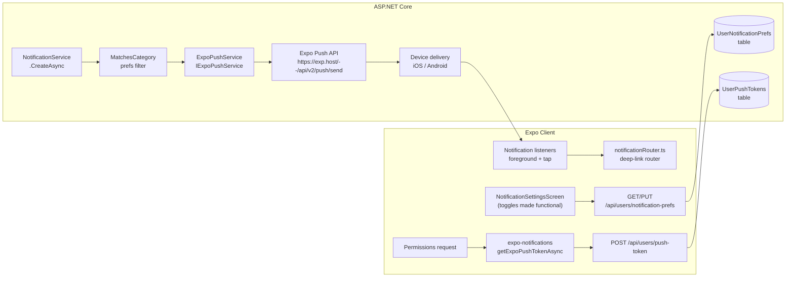
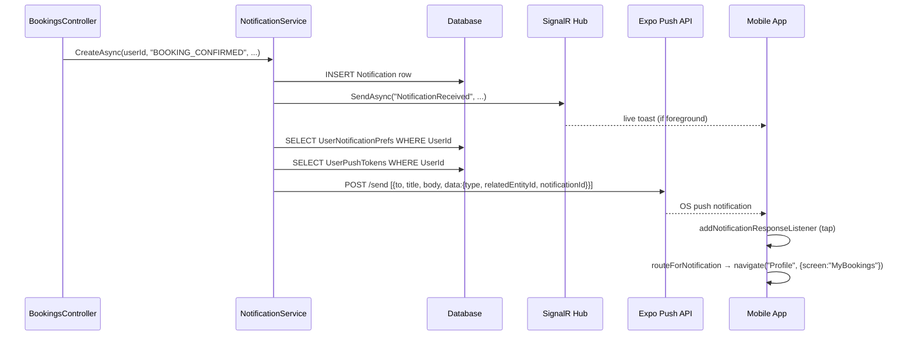

# Push Notifications Blueprint — `pet-owner-mobile`

> Status: Plan only. No `.ts/.tsx/.cs` files will be edited until this document is approved.

---

## 0. Goals & Decisions Snapshot

- **Delivery mechanism**: Use **Expo Push** (not raw FCM/APNs directly) because the project is fully Expo-managed (`app.json` SDK ~54, `newArchEnabled: true`). Expo abstracts both APNs (iOS) and FCM (Android) through a single unified API.
- **Server integration**: Re-use the existing [`NotificationService.cs`](src/PetOwner.Api/Services/NotificationService.cs). Every `CreateAsync` call that today writes a DB row **+** broadcasts on SignalR will **additionally** fan-out to Expo Push when the recipient (a) has a registered push token, and (b) has the matching category preference enabled.
- **Settings source of truth**: The 6 toggles in [`NotificationSettingsScreen.tsx`](src/pet-owner-mobile/src/screens/profile/NotificationSettingsScreen.tsx) (`push`, `messages`, `bookings`, `community`, `triage`, `marketing`) become the **single source of truth** for whether a push is delivered. The master `push` toggle gates everything; the other five gate delivery by `Notification.Type` category. **These toggles are currently non-functional (backed only by local `useState` with a stub `Alert.alert` save). Making them real and persisted is a primary deliverable of this plan.**
- **Web is a no-op**: Expo Push is native-only. All push-related code will be guarded by `Platform.OS !== "web"`, exactly as [`biometricService.ts`](src/pet-owner-mobile/src/services/biometricService.ts) handles it.
- **No duplicate toasts**: When both SignalR's `NotificationReceived` and an Expo push arrive for the same `notificationId`, `notificationStore` skips the duplicate by checking `notifications.some(n => n.id === id)`.

### High-level architecture



### End-to-end sequence (new booking notification)



---

## 1. Client-Side Setup (Expo)

### 1.1 Dependencies

Install via `npx expo install` (do **not** hand-edit version strings in `package.json` — let Expo resolve the correct SDK 54-compatible versions):

```bash
npx expo install expo-notifications expo-device
```

- **`expo-notifications`** — permission requests, token generation, listeners, channel setup.
- **`expo-device`** — `Device.isDevice` guard: Expo Push tokens cannot be generated on iOS Simulator.

Both will be added to [`package.json`](src/pet-owner-mobile/package.json) automatically.

### 1.2 `app.json` updates

Edit [`src/pet-owner-mobile/app.json`](src/pet-owner-mobile/app.json). The current file has no push-notification config. Required additions:

```jsonc
{
  "expo": {
    // ... existing fields ...

    "extra": {
      "eas": {
        "projectId": "<YOUR_EAS_PROJECT_ID>"   // required by getExpoPushTokenAsync on SDK 49+
      }
    },

    "android": {
      // ... existing android keys ...
      "useNextNotificationsApi": true,          // required for Expo SDK 51+
      "notification": {
        "icon": "./assets/notification-icon.png",  // 96x96 white-on-transparent PNG
        "color": "#000000"
      }
    },

    "plugins": [
      // ... existing plugins (expo-secure-store, expo-local-authentication, etc.) ...
      [
        "expo-notifications",
        {
          "icon": "./assets/notification-icon.png",
          "color": "#000000",
          "sounds": [],
          "mode": "production"
        }
      ]
    ]
  }
}
```

> iOS: The `expo-notifications` plugin handles APNs entitlements automatically during `eas build`. The existing `infoPlist.NSFaceIDUsageDescription` key is unaffected.

### 1.3 New module: `src/pet-owner-mobile/src/services/pushService.ts`

This module mirrors the shape and coding style of the existing [`biometricService.ts`](src/pet-owner-mobile/src/services/biometricService.ts) — stateless helper functions, `Platform.OS === "web"` guards, `expo-secure-store` for token persistence.

```ts
import { Platform } from "react-native";
import * as Notifications from "expo-notifications";
import * as Device from "expo-device";
import * as SecureStore from "expo-secure-store";
import Constants from "expo-constants";

const PUSH_TOKEN_KEY = "push_token";

export type TapPayload = {
  type: string;
  relatedEntityId?: string;
  notificationId?: string;
};

/** Returns true when running on a real device (push tokens require hardware). */
export function isSupported(): boolean {
  return Platform.OS !== "web" && !!Device.isDevice;
}

/**
 * Requests OS-level permission for push notifications.
 * - If already granted or denied, returns current status without a prompt.
 * - Only calls requestPermissionsAsync() when status is "undetermined".
 */
export async function ensurePermission(): Promise<Notifications.PermissionStatus> {
  if (!isSupported()) return Notifications.PermissionStatus.DENIED;

  // Android 13+: create the default channel before requesting permission.
  if (Platform.OS === "android") {
    await Notifications.setNotificationChannelAsync("default", {
      name: "Default",
      importance: Notifications.AndroidImportance.MAX,
      vibrationPattern: [0, 250, 250, 250],
      lightColor: "#FF231F7C",
    });
  }

  const { status: existing } = await Notifications.getPermissionsAsync();
  if (existing !== Notifications.PermissionStatus.UNDETERMINED) return existing;

  const { status } = await Notifications.requestPermissionsAsync();
  return status;
}

/**
 * Full registration flow:
 * 1. Ensure permission.
 * 2. Get ExpoPushToken (scoped to projectId from app.json EAS config).
 * 3. Compare against persisted token — return null if unchanged to avoid redundant backend calls.
 * Returns the token string, or null if unsupported / denied / unchanged.
 */
export async function registerForPushNotifications(): Promise<string | null> {
  if (!isSupported()) return null;

  const status = await ensurePermission();
  if (status !== Notifications.PermissionStatus.GRANTED) return null;

  const projectId = Constants.expoConfig?.extra?.eas?.projectId;
  const { data: token } = await Notifications.getExpoPushTokenAsync({ projectId });

  const stored = await SecureStore.getItemAsync(PUSH_TOKEN_KEY);
  if (stored === token) return null; // no change, skip backend sync

  await SecureStore.setItemAsync(PUSH_TOKEN_KEY, token);
  return token;
}

/**
 * Removes the stored token from SecureStore (called on logout or when
 * the master push toggle is turned OFF — backend DELETE is the caller's responsibility).
 */
export async function clearStoredToken(): Promise<void> {
  try {
    await SecureStore.deleteItemAsync(PUSH_TOKEN_KEY);
  } catch {
    // already absent
  }
}

/** Returns the last token persisted to SecureStore, or null. */
export async function getStoredToken(): Promise<string | null> {
  if (Platform.OS === "web") return null;
  try {
    return await SecureStore.getItemAsync(PUSH_TOKEN_KEY);
  } catch {
    return null;
  }
}

/**
 * Attaches both foreground-received and notification-tap listeners.
 * Returns a cleanup function to be called on unmount / logout.
 *
 * The foreground handler (setNotificationHandler) must be called once at
 * app startup in App.tsx — it is NOT set here to avoid re-registration.
 */
export function attachNotificationListeners(
  onTap: (payload: TapPayload) => void,
): () => void {
  const tapSub = Notifications.addNotificationResponseReceivedListener((response) => {
    const data = response.notification.request.content.data as TapPayload;
    if (data?.type) onTap(data);
  });

  return () => {
    tapSub.remove();
  };
}
```

### 1.4 Global notification handler (App.tsx)

The foreground display handler must be set **once at module load**, before the first render, in `App.tsx`:

```ts
import * as Notifications from "expo-notifications";

// Place this outside the component, at module scope:
Notifications.setNotificationHandler({
  handleNotification: async () => ({
    shouldShowBanner: true,   // SDK 51+ replaces deprecated shouldShowAlert
    shouldShowList: true,
    shouldPlaySound: true,
    shouldSetBadge: true,
  }),
});
```

Without this, Expo silently drops notifications when the app is in the foreground (default behavior).

### 1.5 Hooking into the auth lifecycle

Edit [`src/pet-owner-mobile/src/store/authStore.ts`](src/pet-owner-mobile/src/store/authStore.ts). The existing `startHubs()` / `stopHubs()` pattern already manages SignalR and notification store startup via dynamic imports. Push registration follows the same pattern:

**In `startHubs()`**, add after the existing imports:

```ts
import("../services/pushService").then(async (push) => {
  const token = await push.registerForPushNotifications();
  if (token) {
    import("../api/client").then(({ notificationsApi }) => {
      notificationsApi.registerPushToken(token, Platform.OS as "ios" | "android").catch(() => {});
    });
  }
});
```

**In `stopHubs()`**, add:

```ts
import("../services/pushService").then(async (push) => {
  const token = await push.getStoredToken();
  if (token) {
    import("../api/client").then(({ notificationsApi }) => {
      notificationsApi.removePushToken(token).catch(() => {});
    });
  }
  push.clearStoredToken().catch(() => {});
});
```

---

## 2. Wiring the Existing Settings UI

> **IMPORTANT: The existing UI toggles in [`NotificationSettingsScreen.tsx`](src/pet-owner-mobile/src/screens/profile/NotificationSettingsScreen.tsx) are currently non-functional.** They are backed only by local `useState`, and `handleSave` does nothing but show `Alert.alert(t("notifSaved"))`. This plan makes them fully functional and persisted.

### 2.1 New Zustand store: `src/pet-owner-mobile/src/store/notificationPrefsStore.ts`

```ts
import { create } from "zustand";
import { notificationsApi } from "../api/client";

export type NotifPrefKey =
  | "push"
  | "messages"
  | "bookings"
  | "community"
  | "triage"
  | "marketing";

const ALL_KEYS: NotifPrefKey[] = [
  "push", "messages", "bookings", "community", "triage", "marketing",
];

const DEFAULT_PREFS: Record<NotifPrefKey, boolean> = {
  push: true, messages: true, bookings: true,
  community: true, triage: true, marketing: true,
};

interface NotifPrefsState {
  prefs: Record<NotifPrefKey, boolean>;
  loading: boolean;
  dirty: boolean;
  fetch: () => Promise<void>;
  setPref: (key: NotifPrefKey, value: boolean) => void;
  save: () => Promise<void>;
  reset: () => void;
}

export const useNotificationPrefsStore = create<NotifPrefsState>((set, get) => ({
  prefs: { ...DEFAULT_PREFS },
  loading: false,
  dirty: false,

  fetch: async () => {
    set({ loading: true });
    try {
      const data = await notificationsApi.getPrefs();
      set({ prefs: data, dirty: false });
    } catch {
      // Network failure — keep defaults so UI remains usable
    } finally {
      set({ loading: false });
    }
  },

  setPref: (key, value) => {
    set((s) => ({ prefs: { ...s.prefs, [key]: value }, dirty: true }));
  },

  save: async () => {
    set({ loading: true });
    try {
      await notificationsApi.updatePrefs(get().prefs);
      set({ dirty: false });
    } finally {
      set({ loading: false });
    }
  },

  reset: () => set({ prefs: { ...DEFAULT_PREFS }, dirty: false, loading: false }),
}));
```

### 2.2 New API methods in `notificationsApi` (client.ts)

Extend the existing `notificationsApi` block in [`src/pet-owner-mobile/src/api/client.ts`](src/pet-owner-mobile/src/api/client.ts):

```ts
export const notificationsApi = {
  // ... existing methods (getAll, getUnreadCount, markRead, markAllRead, remove) ...

  /** Fetch the user's per-category notification preferences from the backend. */
  getPrefs: () =>
    apiClient
      .get<Record<string, boolean>>("/users/notification-prefs")
      .then((r) => r.data),

  /** Persist updated preferences to the backend. */
  updatePrefs: (data: Record<string, boolean>) =>
    apiClient.put("/users/notification-prefs", data),

  /** Register (upsert) an Expo push token for the current user's device. */
  registerPushToken: (token: string, platform: "ios" | "android") =>
    apiClient.post("/users/push-token", { token, platform }),

  /** Remove a push token on logout or when the master push toggle is turned off. */
  removePushToken: (token: string) =>
    apiClient.delete("/users/push-token", { data: { token } }),
};
```

### 2.3 Refactored `NotificationSettingsScreen.tsx`

The refactor touches **only the logic layer** — the JSX markup, styles, and i18n keys remain unchanged to preserve the existing UI design. Changes:

1. **Remove** the local `useState` for `prefs` and the stub `handleSave`.
2. **Add** `useNotificationPrefsStore` as the data source.
3. **Add** a `useEffect` on mount that calls `store.fetch()`.
4. **Wire `toggle`** to call `store.setPref(key, !store.prefs[key])`. For the `push` master toggle, also call the push service to re-register or remove the token:
   ```ts
   const handleToggle = useCallback(async (key: NotifPrefKey) => {
     const newVal = !prefs[key];
     store.setPref(key, newVal);
     if (key === "push") {
       if (newVal) {
         // Re-register token when master toggle turns back ON
         const push = await import("../../services/pushService");
         const token = await push.registerForPushNotifications();
         if (token) {
           await notificationsApi.registerPushToken(token, Platform.OS as "ios" | "android");
         } else {
           // Permission denied — the banner (see below) guides the user to Settings
         }
       } else {
         // Remove token when master toggle turns OFF
         const push = await import("../../services/pushService");
         const token = await push.getStoredToken();
         if (token) {
           await notificationsApi.removePushToken(token).catch(() => {});
         }
         await push.clearStoredToken();
       }
     }
   }, [prefs]);
   ```
5. **Replace `handleSave`**:
   ```ts
   const handleSave = async () => {
     await store.save();
     Alert.alert(t("notifSaved"));
   };
   ```
6. **Add a denied-permission banner** above the toggles list. Check permission status on mount:
   ```ts
   const [permDenied, setPermDenied] = useState(false);
   useEffect(() => {
     Notifications.getPermissionsAsync().then(({ status }) => {
       setPermDenied(status === PermissionStatus.DENIED);
     });
   }, []);
   ```
   Render a yellow inline banner with an "Open Settings" button (`Linking.openSettings()`) when `permDenied` is true and the master `push` toggle is ON.

### 2.4 Toggle → notification type mapping

The backend filters push delivery by comparing `Notification.Type` against the user's per-category preference. The mapping is:

| Toggle key   | Notification types included                                            |
|--------------|------------------------------------------------------------------------|
| `messages`   | `CHAT_MESSAGE`, `NEW_MESSAGE`                                          |
| `bookings`   | `BOOKING_CREATED`, `BOOKING_CONFIRMED`, `BOOKING_CANCELLED`, `PAYMENT_RECEIVED` |
| `community`  | `GROUP_POST`, `POST_COMMENT`, `POST_LIKE`                              |
| `triage`     | `TRIAGE_RESULT`, `VACCINE_DUE`, `SOS_ALERT`                           |
| `marketing`  | `PROMOTION`, `ANNOUNCEMENT`                                            |

This mapping is encoded on the **server** in the `MatchesCategory(prefs, type)` helper (see §3.4). No changes to the client-side Expo notification category system (`setNotificationCategoryAsync`) are required for v1.

### 2.5 i18n additions

All existing keys are already present in [`src/pet-owner-mobile/src/i18n/index.ts`](src/pet-owner-mobile/src/i18n/index.ts) (lines 693–699 for Hebrew, 1641–1647 for English):
`notifSettingsTitle`, `notifPush`, `notifMessages`, `notifBookings`, `notifCommunity`, `notifTriage`, `notifMarketing`, `notifSaved`.

**New keys to add** (Hebrew + English):

| Key | English | Hebrew |
|-----|---------|--------|
| `notifPermissionDenied` | "Push notifications are blocked by your device settings." | "התראות דחיפה חסומות בהגדרות המכשיר שלך." |
| `notifOpenSettings` | "Open Settings" | "פתח הגדרות" |
| `notifPushDisabledBanner` | "Enable notifications in your device settings to receive push alerts." | "אפשר התראות בהגדרות המכשיר כדי לקבל התראות דחיפה." |

---

## 3. Backend Integration (ASP.NET Core)

### 3.1 New data models (`PetOwner.Data.Models`)

**`UserPushToken.cs`**
```csharp
namespace PetOwner.Data.Models;

public class UserPushToken
{
    public Guid Id { get; set; }
    public Guid UserId { get; set; }
    public string Token { get; set; } = null!;       // ExponentPushToken[xxxxxxxx]
    public string Platform { get; set; } = null!;    // "ios" | "android"
    public DateTime CreatedAt { get; set; }
    public DateTime LastUsedAt { get; set; }

    public User User { get; set; } = null!;
}
```

**`UserNotificationPrefs.cs`**
```csharp
namespace PetOwner.Data.Models;

public class UserNotificationPrefs
{
    public Guid UserId { get; set; }         // PK + FK → User
    public bool PushEnabled { get; set; } = true;
    public bool Messages { get; set; } = true;
    public bool Bookings { get; set; } = true;
    public bool Community { get; set; } = true;
    public bool Triage { get; set; } = true;
    public bool Marketing { get; set; } = true;
    public DateTime UpdatedAt { get; set; }

    public User User { get; set; } = null!;
}
```

**`User.cs` additions** (navigation properties):
```csharp
public ICollection<UserPushToken> PushTokens { get; set; } = [];
public UserNotificationPrefs? NotificationPrefs { get; set; }
```

**`ApplicationDbContext` additions**:
```csharp
public DbSet<UserPushToken> UserPushTokens => Set<UserPushToken>();
public DbSet<UserNotificationPrefs> UserNotificationPrefs => Set<UserNotificationPrefs>();
```

With model builder configuration:
```csharp
modelBuilder.Entity<UserPushToken>()
    .HasIndex(t => t.Token).IsUnique();

modelBuilder.Entity<UserNotificationPrefs>()
    .HasKey(p => p.UserId);
modelBuilder.Entity<UserNotificationPrefs>()
    .HasOne(p => p.User)
    .WithOne(u => u.NotificationPrefs)
    .HasForeignKey<UserNotificationPrefs>(p => p.UserId);
```

**Migration**: `dotnet ef migrations add AddPushNotificationSupport`

### 3.2 New `UsersController.cs`

Route: `api/users`. All endpoints are `[Authorize]`.

```csharp
[ApiController]
[Route("api/users")]
[Authorize]
public class UsersController : ControllerBase
{
    // POST /api/users/push-token
    // Body: { "token": "ExponentPushToken[...]", "platform": "ios" }
    // Upserts by token value so rotating tokens don't create duplicates.
    [HttpPost("push-token")]
    public async Task<IActionResult> RegisterPushToken([FromBody] RegisterPushTokenDto dto) { ... }

    // DELETE /api/users/push-token
    // Body: { "token": "ExponentPushToken[...]" }
    [HttpDelete("push-token")]
    public async Task<IActionResult> RemovePushToken([FromBody] RemovePushTokenDto dto) { ... }

    // GET /api/users/notification-prefs
    // Returns the 6 boolean prefs. Creates a default record on first access.
    [HttpGet("notification-prefs")]
    public async Task<IActionResult> GetNotificationPrefs() { ... }

    // PUT /api/users/notification-prefs
    // Body: { "push": true, "messages": false, ... }
    [HttpPut("notification-prefs")]
    public async Task<IActionResult> UpdateNotificationPrefs([FromBody] NotificationPrefsDto dto) { ... }
}
```

User identity resolved from `ClaimTypes.NameIdentifier` — identical pattern to [`NotificationsController.cs`](src/PetOwner.Api/Controllers/NotificationsController.cs).

**DTOs** (add to `PetOwner.Api/DTOs`):

```csharp
public record RegisterPushTokenDto(string Token, string Platform);
public record RemovePushTokenDto(string Token);
public record NotificationPrefsDto(
    bool Push, bool Messages, bool Bookings,
    bool Community, bool Triage, bool Marketing);
```

### 3.3 New `IExpoPushService` + `ExpoPushService`

**Interface** (`PetOwner.Api/Services/IExpoPushService.cs`):
```csharp
public interface IExpoPushService
{
    Task SendAsync(IEnumerable<string> tokens, string title, string body, object? data = null);
}
```

**Implementation** (`PetOwner.Api/Services/ExpoPushService.cs`):
- Injects `HttpClient` (registered in `Program.cs` as a typed client).
- Sends to `https://exp.host/--/api/v2/push/send`.
- Chunks tokens into batches of ≤ 100 (Expo's documented limit).
- Sets `Accept: application/json` and `Accept-Encoding: gzip, deflate`.
- Reads the response's `data[].status === "error"` with `details.error === "DeviceNotRegistered"` and removes those tokens from `UserPushTokens` in a fire-and-forget cleanup.

**Registration** in `Program.cs`:
```csharp
builder.Services.AddHttpClient<IExpoPushService, ExpoPushService>(client =>
{
    client.BaseAddress = new Uri("https://exp.host");
    client.Timeout = TimeSpan.FromSeconds(15);
});
```

### 3.4 Augmenting `NotificationService.CreateAsync`

Edit [`src/PetOwner.Api/Services/NotificationService.cs`](src/PetOwner.Api/Services/NotificationService.cs). Inject `IExpoPushService _expoPush` via constructor. After the existing SignalR broadcast, add:

```csharp
// Push notification fan-out (gated by user prefs)
var prefs = await _db.UserNotificationPrefs
    .AsNoTracking()
    .FirstOrDefaultAsync(p => p.UserId == userId);

if (prefs != null && prefs.PushEnabled && MatchesCategory(prefs, type))
{
    var tokens = await _db.UserPushTokens
        .AsNoTracking()
        .Where(t => t.UserId == userId)
        .Select(t => t.Token)
        .ToListAsync();

    if (tokens.Count > 0)
    {
        await _expoPush.SendAsync(tokens, title, message, new
        {
            type,
            relatedEntityId,
            notificationId = notification.Id,
        });
    }
}
```

**`MatchesCategory` helper**:
```csharp
private static bool MatchesCategory(UserNotificationPrefs prefs, string type) => type switch
{
    "CHAT_MESSAGE" or "NEW_MESSAGE"                                         => prefs.Messages,
    "BOOKING_CREATED" or "BOOKING_CONFIRMED"
        or "BOOKING_CANCELLED" or "PAYMENT_RECEIVED"                       => prefs.Bookings,
    "GROUP_POST" or "POST_COMMENT" or "POST_LIKE"                          => prefs.Community,
    "TRIAGE_RESULT" or "VACCINE_DUE" or "SOS_ALERT"                       => prefs.Triage,
    "PROMOTION" or "ANNOUNCEMENT"                                          => prefs.Marketing,
    _                                                                       => true,
};
```

`BroadcastAsync` receives the same treatment: bulk-fetch all users' prefs and tokens in a single query, group by userId, filter by category, then send batched.

---

## 4. Foreground / Background / Killed Handling

| App State | Mechanism | Behavior |
|-----------|-----------|----------|
| **Foreground** | `Notifications.setNotificationHandler` (set once in `App.tsx`) returning `shouldShowBanner: true` | OS banner is shown **and** `useNotificationStore.pushLive(n)` is called to inject the entry into the in-app notification list |
| **Foreground** | `Notifications.addNotificationReceivedListener` in `pushService.attachNotificationListeners` | Also used to push into `notificationStore` for dedup-safe live update |
| **Background** | OS delivers the push, shows it natively | User tap fires `addNotificationResponseReceivedListener` → `routeForNotification` |
| **Killed (cold start)** | `Notifications.getLastNotificationResponseAsync()` in `App.tsx` after `authStore.hydrate()` | Navigate to the appropriate screen after hydration completes |

### 4.1 Deduplication rule

Both SignalR (`NotificationReceived`) and Expo Push carry the same `notificationId` in their payload. Before calling `useNotificationStore.getState().pushLive(n)`, check:

```ts
const exists = useNotificationStore.getState().notifications.some(n => n.id === incomingId);
if (!exists) useNotificationStore.getState().pushLive(n);
```

This prevents double-entries when both channels deliver the same notification while the app is in the foreground.

---

## 5. Deep Linking & Navigation

### 5.1 Export `navigationRef` from `AppNavigator.tsx`

In [`src/pet-owner-mobile/src/navigation/AppNavigator.tsx`](src/pet-owner-mobile/src/navigation/AppNavigator.tsx), create and export a `navigationRef` that the `NavigationContainer` in `App.tsx` will use:

```ts
import { createNavigationContainerRef } from "@react-navigation/native";

export const navigationRef = createNavigationContainerRef<RootParamList>();
```

Pass it to `<NavigationContainer ref={navigationRef}>` in `App.tsx`.

### 5.2 New module: `src/pet-owner-mobile/src/services/notificationRouter.ts`

```ts
import type { NavigationContainerRef } from "@react-navigation/native";
import { useNotificationStore } from "../store/notificationStore";
import type { TapPayload } from "./pushService";

export function routeForNotification(
  nav: NavigationContainerRef<any>,
  payload: TapPayload,
): void {
  if (!nav.isReady()) return;

  switch (payload.type) {
    case "BOOKING_CREATED":
    case "BOOKING_CONFIRMED":
    case "BOOKING_CANCELLED":
    case "PAYMENT_RECEIVED":
      nav.navigate("Profile", {
        screen: "MyBookings",
        params: { bookingId: payload.relatedEntityId },
      });
      break;

    case "CHAT_MESSAGE":
    case "NEW_MESSAGE":
      nav.navigate("Messages", {
        screen: "ChatRoom",
        params: { otherUserId: payload.relatedEntityId },
      });
      break;

    case "TRIAGE_RESULT":
      nav.navigate("MyPets", {
        screen: "Triage",
        params: { historyId: payload.relatedEntityId },
      });
      break;

    case "GROUP_POST":
    case "POST_COMMENT":
      nav.navigate("Community", {
        screen: "GroupDetail",
        params: { groupId: payload.relatedEntityId },
      });
      break;

    case "SOS_ALERT":
    case "VACCINE_DUE":
      nav.navigate("MyPets", { screen: "MyPetsMain" });
      break;

    default:
      nav.navigate("Profile", { screen: "Notifications" });
      break;
  }

  // Mark the notification read when navigating from a tap
  if (payload.notificationId) {
    useNotificationStore.getState().markRead(payload.notificationId).catch(() => {});
  }
}
```

The screen names (`MyBookings`, `ChatRoom`, `Triage`, `GroupDetail`, `Notifications`) already exist in the stacks defined in [`AppNavigator.tsx`](src/pet-owner-mobile/src/navigation/AppNavigator.tsx) — no new routes are required.

### 5.3 Wiring in `App.tsx`

```ts
import { navigationRef } from "./src/navigation/AppNavigator";
import { attachNotificationListeners } from "./src/services/pushService";
import { routeForNotification } from "./src/services/notificationRouter";
import * as Notifications from "expo-notifications";

// ... inside App component:
useEffect(() => {
  // Attach tap listener (returns cleanup)
  const cleanup = attachNotificationListeners((payload) => {
    routeForNotification(navigationRef, payload);
  });

  // Cold-start: check if app was opened via a notification tap
  Notifications.getLastNotificationResponseAsync().then((response) => {
    if (response) {
      const data = response.notification.request.content.data as TapPayload;
      if (data?.type) {
        // Delay until navigation is ready and auth is hydrated
        const unsubscribe = navigationRef.addListener("state", () => {
          routeForNotification(navigationRef, data);
          unsubscribe();
        });
      }
    }
  });

  return cleanup;
}, []);
```

### 5.4 Audit `relatedEntityId` in existing `NotificationService` calls

To make deep-linking work correctly, every `NotificationService.CreateAsync(...)` call across the codebase must pass a meaningful `relatedEntityId`. Files to audit:

- `BookingsController.cs` — should pass `booking.Id`
- `ChatHub.cs` — should pass the sender's `userId`
- `TeletriageController.cs` — should pass `triage.Id`
- `AdminController.cs` (SOS, provider approval) — pass the relevant entity id

---

## 6. Step-by-Step Execution

### Phase A — Permissions & Token Generation (client-only)

1. Run `npx expo install expo-notifications expo-device` inside `src/pet-owner-mobile/`.
2. Update [`app.json`](src/pet-owner-mobile/app.json): add `expo-notifications` plugin, `extra.eas.projectId`, Android notification config.
3. Create `src/pet-owner-mobile/src/services/pushService.ts` (full implementation per §1.3).
4. In `App.tsx`: add `Notifications.setNotificationHandler(...)` at module scope (§1.4).
5. Add `notificationsApi.registerPushToken` and `notificationsApi.removePushToken` methods to [`client.ts`](src/pet-owner-mobile/src/api/client.ts) (§2.2) — these can be stubbed (returning `Promise.resolve()`) while the backend endpoint doesn't exist yet.
6. Hook `pushService.registerForPushNotifications` into `authStore.startHubs` (§1.5).
7. **Smoke-test**: Log the token to the console; use the [Expo Push Notifications Tool](https://expo.dev/notifications) to send a test message to the token. Verify the banner appears when the app is open.

### Phase B — Backend Token Storage + Expo Push Fan-out

1. Add `UserPushToken.cs` and `UserNotificationPrefs.cs` models (§3.1).
2. Update `User.cs` navigation properties and `ApplicationDbContext`.
3. Run `dotnet ef migrations add AddPushNotificationSupport`.
4. Create `UsersController.cs` with the 4 endpoints (§3.2).
5. Create `IExpoPushService` + `ExpoPushService` (§3.3); register in `Program.cs`.
6. Augment `NotificationService.CreateAsync` + `BroadcastAsync` (§3.4).
7. **Smoke-test**: Trigger a booking confirmation in the app. Confirm an Expo push arrives even when the app is killed.

### Phase C — Wire the Settings Toggles (the explicit ask)

> **These toggles are currently non-functional. Making them real is the primary goal of this phase.**

1. Extend `notificationsApi` in [`client.ts`](src/pet-owner-mobile/src/api/client.ts) with `getPrefs` and `updatePrefs` (§2.2).
2. Create `src/pet-owner-mobile/src/store/notificationPrefsStore.ts` (§2.1).
3. Refactor [`NotificationSettingsScreen.tsx`](src/pet-owner-mobile/src/screens/profile/NotificationSettingsScreen.tsx):
   - Remove `useState`-only `prefs` initialization.
   - Source prefs from `useNotificationPrefsStore`.
   - `useEffect` on mount → `store.fetch()`.
   - `toggle` → `handleToggle` (with push-token side-effects for master toggle).
   - `handleSave` → `await store.save()`.
   - Add permission-denied banner.
4. Add the 3 new i18n keys (§2.5).
5. **Smoke-test**: Toggle off "Bookings". Trigger a booking event. Confirm no push is received but the SignalR in-app notification still appears.

### Phase D — Deep Linking & Navigation

1. Export `navigationRef` from [`AppNavigator.tsx`](src/pet-owner-mobile/src/navigation/AppNavigator.tsx) (§5.1).
2. Create `src/pet-owner-mobile/src/services/notificationRouter.ts` (§5.2).
3. Wire `attachNotificationListeners` + cold-start check in `App.tsx` (§5.3).
4. Audit `relatedEntityId` usage in all `NotificationService.CreateAsync` call sites (§5.4).
5. **Smoke-test each deep-link type** (see §8).

---

## 7. Out of Scope for v1

These are explicitly deferred and should be tracked as follow-up issues:

- **Per-pet notification preferences** (only global toggles for v1).
- **Quiet hours / "Do not disturb" window** on the client side.
- **Rich media notifications** (images, action buttons in the notification shade).
- **Web push** (not possible with Expo Push; would require a separate `web-push` integration).
- **Silent background pushes** for data sync.
- **iOS notification grouping** via `Notifications.setNotificationCategoryAsync` — the toggles already handle this server-side for v1.
- **Expo Push receipt polling** (background hosted service to clean up `DeviceNotRegistered` tokens via the Expo Push receipts API — v1 handles this inline in `ExpoPushService`).

---

## 8. Test Plan

### Phase A — Permissions
- [ ] Fresh install on a real iOS device → system permission dialog appears → grant → token is logged and POSTed to `/api/users/push-token`.
- [ ] Deny permission on first prompt → no token POST → yellow banner appears in `NotificationSettingsScreen`.
- [ ] Banner "Open Settings" button → device Settings app opens to app notification page.
- [ ] Toggle master `push` OFF → `DELETE /api/users/push-token` is called.
- [ ] Toggle master `push` ON again (permission previously granted) → token re-registered.

### Phase B — Foreground / Background / Killed
- [ ] App in **foreground**: send push via [Expo Push Tool](https://expo.dev/notifications) → OS banner appears AND notification entry appears in `NotificationsScreen` without duplicate.
- [ ] App in **background**: push arrives → tap notification → app comes to foreground.
- [ ] App **killed**: tap notification → app cold-starts → after auth hydration, navigates to the correct deep-link target.

### Phase C — Toggle Verification
- [ ] Toggle off `bookings` → backend triggers `BOOKING_CONFIRMED` → in-app SignalR notification still appears, **no Expo push delivered**.
- [ ] Toggle off `messages` → receive a chat message → in-app notification appears, **no push**.
- [ ] Toggle back ON → next event in that category delivers a push again.
- [ ] Logout → token row removed from `UserPushTokens` → sending to that token returns `DeviceNotRegistered` (verify via Expo receipt endpoint).

### Phase D — Deep-link Accuracy
- [ ] `BOOKING_CONFIRMED` tap → opens `MyBookings` screen, `bookingId` param populated.
- [ ] `CHAT_MESSAGE` tap → opens `ChatRoom` with correct `otherUserId`.
- [ ] `TRIAGE_RESULT` tap → opens `Triage` screen.
- [ ] `GROUP_POST` tap → opens `GroupDetail`.
- [ ] Unknown type tap → opens `Notifications` screen.
- [ ] Notification is marked as read after tap in all cases.
